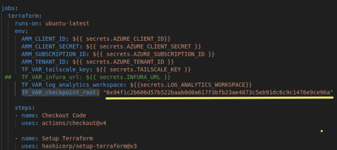
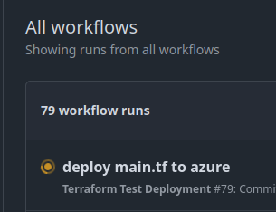
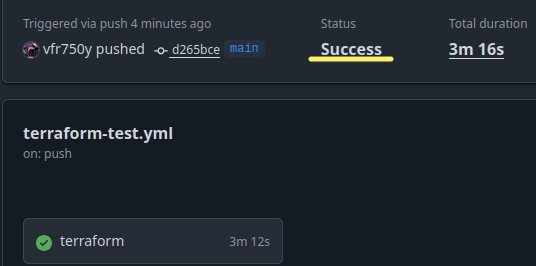
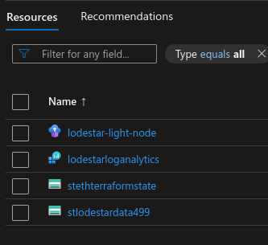
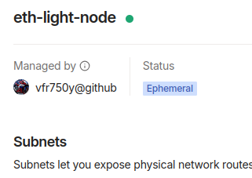
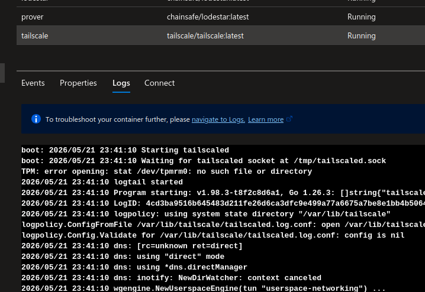
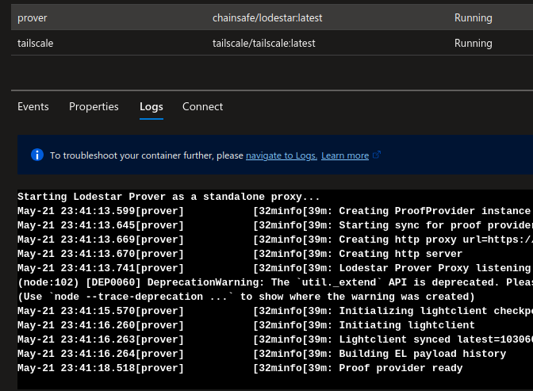
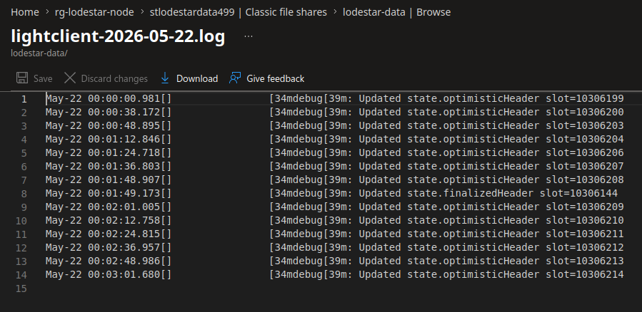

# As Built Implementation Steps

## Pre-requisites
* GitHub account
* Azure subscription
* Tailscale account

## Phase 1: Bootstrapping & Identity

| Step # | Description                                          |           Screenshot                                   |
| :------|:-----------------------------------------------------| :----------------------------------------------------- |
|   1.0    | Log into the [Azure portal](https://portal.azure.com) then <br>log into the Azure Cloud shell |       |
|   1.1    | Create the target resource group <br>At the cloud shell prompt type the commands: <br>``` RG_NAME="rg-lodestar-node" \``` <br>```LOCATION="australiaeast" \``` <br>```az group create --name $RG_NAME --location $LOCATION```   |      |
|   1.2    |  Create the Azure Service Principal (SPN) <br>At the cloud shell prompt type the command: <br>```az ad sp create-for-rbac --name "github-eth-node-sp"``` <br>```--role contributor \``` <br>```--scopes /subscriptions/{subscription-id}``` <br>```/resourceGroups/rg-lodestar-node \``` <br>```--json-auth```  |   |
|   1.3    | Create the Storage Account for state management  <br>``` STORAGE_NAME="stethterraformstate" ``` <br>```az storage account create ``` <br> ```--name $STORAGE_NAME``` <br>```--resource-group rg-lodestar-node``` <br>```--location eastus --sku Standard_LRS <br>``` <br>```az storage container create --name tfstate ``` <br>```--account-name $STORAGE_NAME``` |  |
|   1.4    |Create the Log Analytics Workspace <br>```az monitor log-analytics workspace``` <br>```create --resource-group rg-lodestar-node \``` <br>```--workspace-name lodestarloganalytics``` |   |


## Phase 2: Repository & Secret Management

| Step # | Description                                          |           Screenshot                                   |
| :------|:-----------------------------------------------------| :----------------------------------------------------- |
|   2.1  | Log into [Tailscale](https://login.tailscale.com/admin/) <br>and generate an **Auth Key** in the Tailscale Admin Console. |  <br> |
|   2.2  | Populate GitHub secrets  with `AZURE_CLIENT_ID`, <br>`AZURE_CLIENT_SECRET`, `AZURE_TENANT_ID`, <br>`AZURE_SUBSCRIPTION_ID` . `LOG_ANALYTICS_WORKSPACE`, `TAILSCALE_KEY` |  |

## Phase 3: Infrastructure Deployment and verification

| Step # | Description                                          |           Screenshot                                   |
| :------|:-----------------------------------------------------| :----------------------------------------------------- |
|   3.1  | Get the latest Sepolia [checkpoint](https://https://sepolia.beaconstate.info/) root block <br>and paste it into the TF_VAR_checkpoint_root variable in the .yml file |  |
|   3.2  | Trigger GitHub Actions (e.g. use local git push) to deploy the `main.tf` |  |
|   3.3  | Verify Azure successful GitHub actions         |       |
|   3.4  | Verify resources created in Azure              |    |
|   3.5  | Monitor the Tailscale Admin Console. <br> A new machine named `eth-light-node` should appear. <br>Note its **Tailscale IP** (100.x.y.z). |        |
|  3.6  | Check logs for tailscale and prover containers |  <br>  |
|  3.7  | Edit the log file to view the logsfor the lodestar container <br> they are saved to the file share in the storage account |  |


## Phase 4: Final Validation & Connectivity

### Step 4.1: The "Verified RPC" Test
We verify that MetaMask/Rabby can talk to the **Prover**, which in turn talks to **Lodestar**.
* **Action:** On your local laptop (with Tailscale active), run:
    ```bash
      curl -X POST -H "Content-Type: application/json" \
      --data '{"jsonrpc":"2.0","method":"eth_blockNumber","params":[],"id":1}' \
      http://eth-light-node.tail1df2ad.ts.net:8080
    ```
NOTE: USE FULL TAILSCALE DOMAIN  (or your local hosts file).
* **Verification:** You should receive a hex block number. 
    EXAMPLE OUTPUT : {"jsonrpc":"2.0","id":1,"result":"0xa63cef"}

