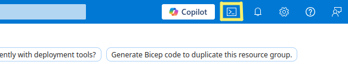
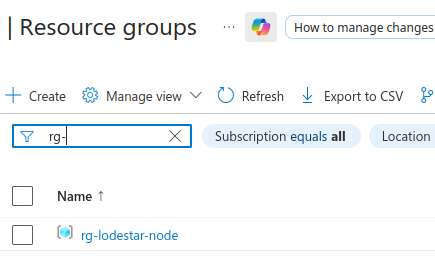

# As built document


| Step # | Description                                          |           Screenshot                                   |
| :------|:-----------------------------------------------------| :----------------------------------------------------- |
|   1    | Log into the Azure Cloud shell                       |       |
|   2    | Create the target resource group<br>RG_NAME="rg-lodestar-node" \<br>LOCATION="australiaeast" \<br>az group create --name $RG_NAME --location $LOCATION   |      |
|   3    |                                                      |                                                        |


           

 
  # Detailed Implementation Steps (Dark Node Architecture)

### Phase 1: Bootstrapping & Identity
Build the Terraform management plane.

#### Step 0 Open an Azure cloud shell
Log into the azure portal
Click on the >_ icon in the portal
Choose Bash

#### Step 1.0: Create the Target Resource Group
```bash
RG_NAME="rg-lodestar-node" \
LOCATION="australiaeast" \
az group create --name $RG_NAME --location $LOCATION
```

#### Step 1.1: Azure Service Principal (SPN) Creation
```bash
az ad sp create-for-rbac --name "github-eth-node-sp" --role contributor \
  --scopes /subscriptions/{subscription-id}/resourceGroups/rg-lodestar-node \
  --json-auth
```

#### Step 1.2: Terraform Backend Setup
* **Action:** Create the Storage Account for state management.
```bash
STORAGE_NAME="stethterraformstate"
az storage account create --name $STORAGE_NAME --resource-group rg-lodestar-node --location eastus --sku Standard_LRS
az storage container create --name tfstate --account-name $STORAGE_NAME
echo "Store this in GitHub Secrets as TF_STATE_STORAGE_ACCOUNT: $STORAGE_NAME"
```


### Phase 2: Repository & Secret Management

#### Step 2.1: Secure Tailscale & Infura Secrets
1. **Tailscale:** Generate an **Auth Key** in the Tailscale Admin Console. 
   - **Settings:** Reusable = Yes, Ephemeral = Yes, Pre-authorized = Yes.
   - **Action:** Save to GitHub Secrets as `TAILSCALE_KEY`.
2. **Infura/Alchemy:** Create a free project and copy the **HTTPS Execution Layer URL** (e.g., `https://sepolia.infura.io/v3/...`).
   - **Action:** Save to GitHub Secrets as `INFURA_URL`.

#### Step 2.2: GitHub Secrets Injection
* **Action:** Populate GitHub Secrets with:
    * `AZURE_CLIENT_ID`, `AZURE_CLIENT_SECRET`, `AZURE_TENANT_ID`, `AZURE_SUBSCRIPTION_ID`
    * `TAILSCALE_KEY`
    * `INFURA_URL`

---

### Phase 3: Infrastructure Deployment (The "Dark" Apply)

#### Step 3.1: Terraform Apply
* **Action:** Trigger GitHub Actions to deploy the `main.tf` with `ip_address_type = "None"`.
* **Verification:** Navigate to the Azure Portal > Container Groups.
    * **Confirm:** The group exists.
    * **Confirm:** There is **no Public IP address** assigned to the instance.

---

### Phase 4: Container Orchestration & Networking

#### Step 4.1: Sidecar Initialization (Tailscale)
* **Action:** Monitor the Tailscale Admin Console.
* **Verification:** A new machine named `eth-light-node` should appear. Note its **Tailscale IP** (100.x.y.z).

#### Step 4.2: Lodestar & Prover Startup
* **Action:** Stream the logs for the three containers:
    ```bash
    # Check Light Client Sync
    az container logs -g rg-lodestar-node -n lodestar-dark-node --container-name lodestar
    # Check Prover Proxy Connectivity
    az container logs -g rg-lodestar-node -n lodestar-dark-node --container-name prover
    ```
* **Verification:** * `lodestar`: Look for `Verified transition to new sync committee`.
    * `prover`: Look for `Proxy server listening on port 8080`.

---

### Phase 5: Final Validation & Connectivity

#### Step 5.1: The "Verified RPC" Test
We verify that MetaMask/Rabby can talk to the **Prover**, which in turn talks to **Lodestar**.
* **Action:** On your local laptop (with Tailscale active), run:
    ```bash
    curl -X POST -H "Content-Type: application/json" \
      --data '{"jsonrpc":"2.0","method":"eth_blockNumber","params":[],"id":1}' \
      http://eth-light-node:8080
    ```
* **Verification:** You should receive a hex block number. This proves the "Dark Node" is fetching data from Infura and verifying it against your light client.

#### Step 5.2: Security Audit (Invisibility Test)
* **Action:** Attempt to ping or port scan your Azure Resource Group's internal IP from outside Tailscale.
* **Verification:** The node should be **unreachable**. There is no public path to the node; it only exists within your private mesh.
