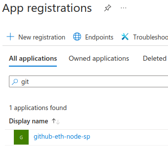
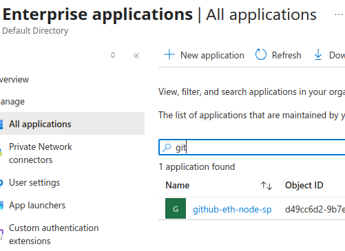
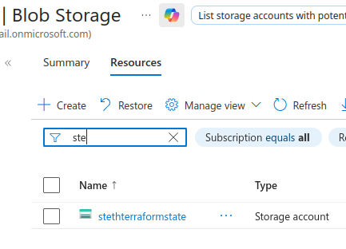
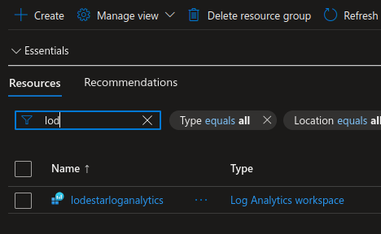
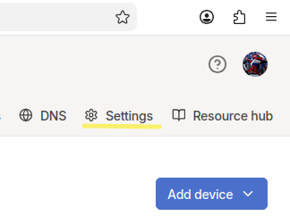
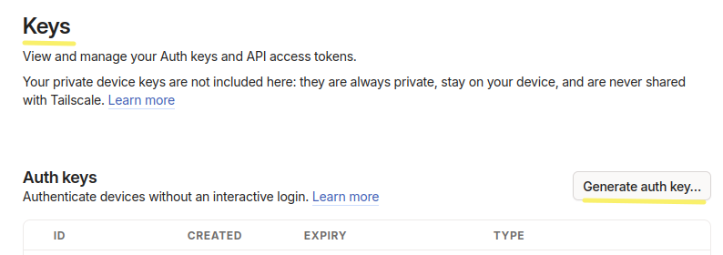
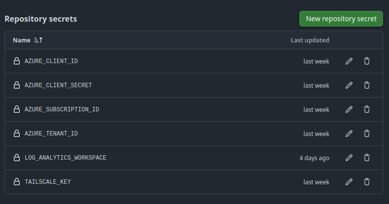

# As Built Implementation Steps

## Pre-requisites
GitHub account
Azure subscription
Tailscale account

## Phase 1: Bootstrapping & Identity

| Step # | Description                                          |           Screenshot                                   |
| :------|:-----------------------------------------------------| :----------------------------------------------------- |
|   1.0    | Log into the [Azure portal](htps://portal.azure.com) then <br>log into the Azure Cloud shell |       |
|   1.1    | Create the target resource group <br>At the cloud shell prompt type the commands: <br>``` RG_NAME="rg-lodestar-node" \``` <br>```LOCATION="australiaeast" \``` <br>```az group create --name $RG_NAME --location $LOCATION```   |      |
|   1.2    |  Create the Azure Service Principal (SPN) <br>At the cloud shell prompt type the command: <br>```az ad sp create-for-rbac --name "github-eth-node-sp"``` <br>```--role contributor \``` <br>```--scopes /subscriptions/{subscription-id}``` <br>```/resourceGroups/rg-lodestar-node \``` <br>```--json-auth```  |   |
|   1.3    | Create the Storage Account for state management  <br>``` STORAGE_NAME="stethterraformstate" ``` <br>```az storage account create ``` <br> ```--name $STORAGE_NAME``` <br>```--resource-group rg-lodestar-node``` <br>```--location eastus --sku Standard_LRS <br>``` <br>```az storage container create --name tfstate ``` <br>```--account-name $STORAGE_NAME``` |  |
|   1.4    |Create the Log Analytics Workspace <br>```az monitor log-analytics workspace``` <br>```create --resource-group rg-lodestar-node \``` <br>```--workspace-name lodestarloganalytics``` |   |


## Phase 2: Repository & Secret Management

| Step # | Description                                          |           Screenshot                                   |
| :------|:-----------------------------------------------------| :----------------------------------------------------- |
|   2.1  | Log into [Tailscale](https://login.tailscale.com/admin/) <br>and generate an **Auth Key** in the Tailscale Admin Console. |  <br> |
|   2.2  | Populate GitHub secrets  with `AZURE_CLIENT_ID`, <br>`AZURE_CLIENT_SECRET`, `AZURE_TENANT_ID`, <br>`AZURE_SUBSCRIPTION_ID` . `LOG_ANALYTICS_WORKSPACE`, `TAILSCALE_KEY` |  |

## Phase 3: Infrastructure Deployment (The "Dark" Apply)

#### Step 3.1: Terraform Apply
* **Action:** Trigger GitHub Actions to deploy the `main.tf` with `ip_address_type = "None"`.
* **Verification:** Navigate to the Azure Portal > Container Groups.
    * **Confirm:** The group exists.
    * **Confirm:** There is **no Public IP address** assigned to the instance.

---

### Phase 4: Container Orchestration & Networking

#### Step 4.1: Sidecar Initialization (Tailscale)
* **Action:** Monitor the Tailscale Admin Console.
* **Verification:** A new machine named `eth-light-node` should appear. Note its **Tailscale IP** (100.x.y.z).

#### Step 4.2: Lodestar & Prover Startup
* **Action:** Stream the logs for the three containers:
    ```bash
    # Check Light Client Sync
    az container logs -g rg-lodestar-node -n lodestar-dark-node --container-name lodestar
    # Check Prover Proxy Connectivity
    az container logs -g rg-lodestar-node -n lodestar-dark-node --container-name prover
    ```
* **Verification:** * `lodestar`: Look for `Verified transition to new sync committee`.
    * `prover`: Look for `Proxy server listening on port 8080`.

---

### Phase 5: Final Validation & Connectivity

#### Step 5.1: The "Verified RPC" Test
We verify that MetaMask/Rabby can talk to the **Prover**, which in turn talks to **Lodestar**.
* **Action:** On your local laptop (with Tailscale active), run:
    ```bash
    curl -X POST -H "Content-Type: application/json" \
      --data '{"jsonrpc":"2.0","method":"eth_blockNumber","params":[],"id":1}' \
      http://eth-light-node:8080
    ```
* **Verification:** You should receive a hex block number. This proves the "Dark Node" is fetching data from Infura and verifying it against your light client.

#### Step 5.2: Security Audit (Invisibility Test)
* **Action:** Attempt to ping or port scan your Azure Resource Group's internal IP from outside Tailscale.
* **Verification:** The node should be **unreachable**. There is no public path to the node; it only exists within your private mesh.
