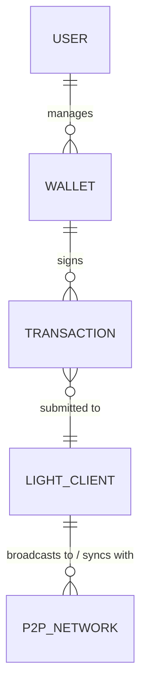
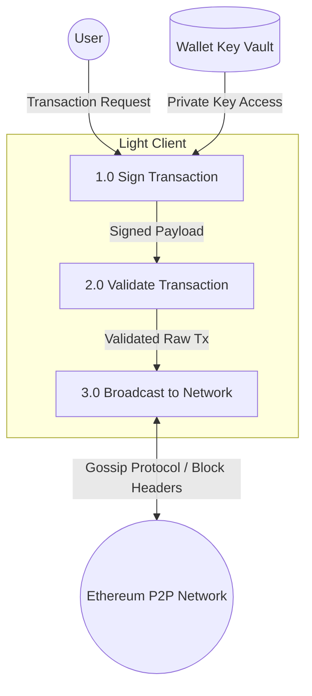
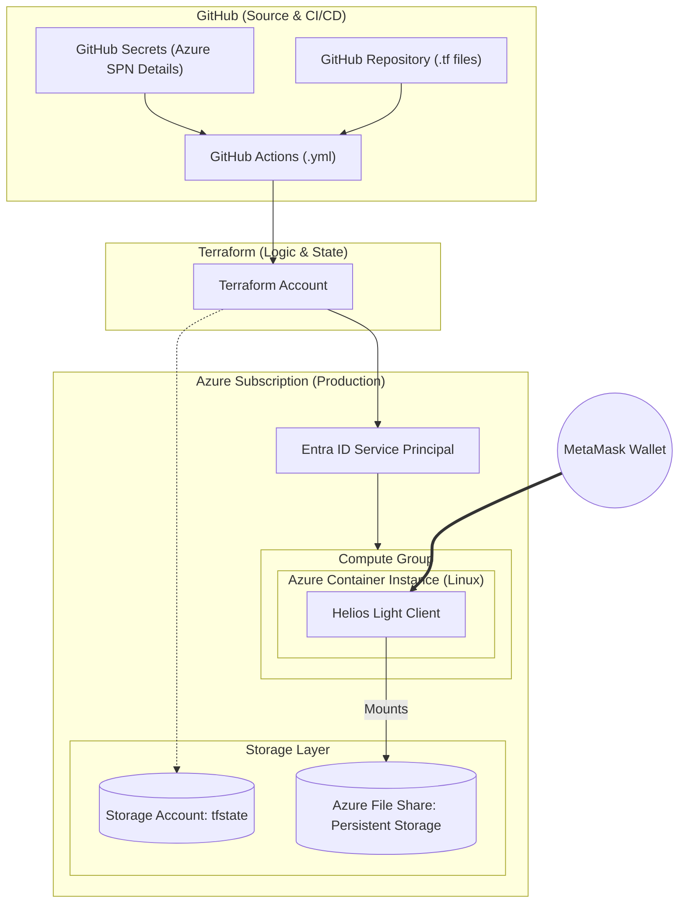

# High Level Design

## Entity relationship diagram

### Diagram explanation
1. User to Wallet
An individual user acts as the owner of the cryptographic keys.
Logic: A User must exist for a Wallet to be managed, but a new User might not have created a Wallet yet (hence "Zero or Many"). However, a Wallet is logically tied to exactly one owner for accountability and access control.

2. Wallet to Transaction
The Wallet uses its private key to digitally sign data payloads, transforming them into valid Ethereum transactions.
Logic: A single Wallet can generate an infinite history of Transactions. Conversely, every Transaction must be signed by exactly one Wallet to be valid on the blockchain; a transaction cannot exist without a source address and a signature.

3. Transaction to Light Client
The signed Transaction is sent to the Light Client.
Logic: A Light Client acts as a gateway; it can receive many different transactions from various sources. From the perspective of the Transaction, it is submitted to one specific node to enter the network, though it may eventually exist on all nodes.

4. Light Client to Ethereum Node Network
The Light Client maintains active P2P (Peer-to-Peer) connections to sync block headers and broadcast transactions.
Logic: To function, a Light Client must be part of exactly one specific network (e.g., Mainnet or Sepolia). It maintains connections to many peers (Full Nodes) simultaneously.

## Data flow diagram

### Explanation of data flow diagram
| Process | Input | Output | Logic / Transformation |
| :--- | :--- | :--- | :--- |
| **1.0 Sign Transaction** | Intent & Private Key | Signed Tx Payload | The Wallet retrieves the private key to apply a cryptographic signature to the transaction parameters (nonce, gas, data). |
| **2.0 Validate & Submit** | Signed Tx Payload | Validated Raw Tx | The Light Client verifies the signature and ensures the transaction format adheres to network standards (e.g., EIP-1559) before submission. |
| **3.0 Broadcast & Sync** | Validated Raw Tx | Network Propagation | The Light Client pushes the transaction to connected peers via Gossip protocol and receives Block Headers to update the local state. |

## Basic high level components
- Metamask Wallet
- GitHub repository for .tf files
- GitHub Actions workflow file (.yml) : defines the actions that perform the Terraform workflow.
- GitHub secrets : Storing the Azure Service Principle details.
- Terraform account : Terraform will check the code against the state file, prepare the deployment and push the changes to Azure.
- Azure subscription 
- Azure Entra ID service principle : to allow GitHub to run the Terraform code.
- Azure storage account : Keeps the Terraform state file.
- Azure container instance (Linux)
- Azure file share : Persistent storage for the Azure container.
- Helios light client (running in the Azure Container Instance)

## System Architecture Diagram (Physical/Cloud)

## Sequence diagram

## Assumptions

## Performance goals and constraints

