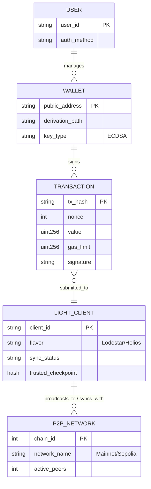

# High Level Design

## High level solution
### Entity relationship diagram

#### Diagram explanation
1. User to Wallet
Relationship: USER ||--o{ WALLET (Exactly One to Zero or Many)

Description: An individual user or an Azure Managed Identity acts as the owner of the cryptographic keys.

Logic: A User must exist for a Wallet to be managed, but a new User might not have created a Wallet yet (hence "Zero or Many"). However, a Wallet is logically tied to exactly one owner for accountability and access control.

2. Wallet to Transaction
Relationship: WALLET ||--o{ TRANSACTION (Exactly One to Zero or Many)

Description: The Wallet uses its private key to digitally sign data payloads, transforming them into valid Ethereum transactions.

Logic: A single Wallet can generate an infinite history of Transactions. Conversely, every Transaction must be signed by exactly one Wallet to be valid on the blockchain; a transaction cannot exist without a source address and a signature.

3. Transaction to Light Client
Relationship: TRANSACTION }o--|| LIGHT_CLIENT (Many to Zero or Exactly One)

Description: The signed Transaction is sent to the Light Client (Lodestar/Helios) via a JSON-RPC request (e.g., eth_sendRawTransaction).

Logic: A Light Client acts as a gateway; it can receive many different transactions from various sources. From the perspective of the Transaction, it is submitted to one specific node to enter the network, though it may eventually exist on all nodes.

4. Light Client to Ethereum Node Network
Relationship: LIGHT_CLIENT ||--o{ P2P_NETWORK (Exactly One to Zero or Many)

Description: The Light Client maintains active P2P (Peer-to-Peer) connections to sync block headers and broadcast transactions.

Logic: To function, a Light Client must be part of exactly one specific network (e.g., Mainnet or Sepolia). It maintains connections to many peers (Full Nodes) simultaneously to verify data via Merkle proofs without needing to store the entire blockchain history.

