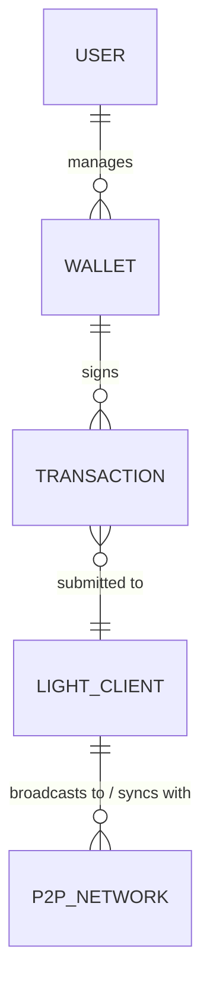
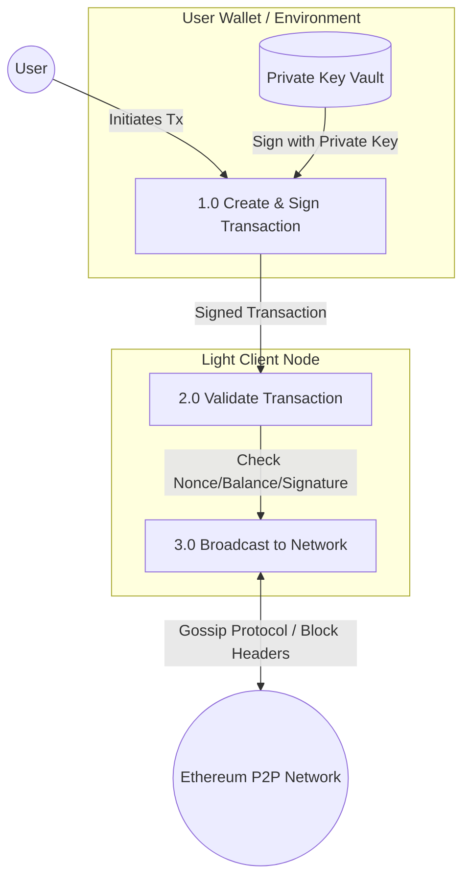
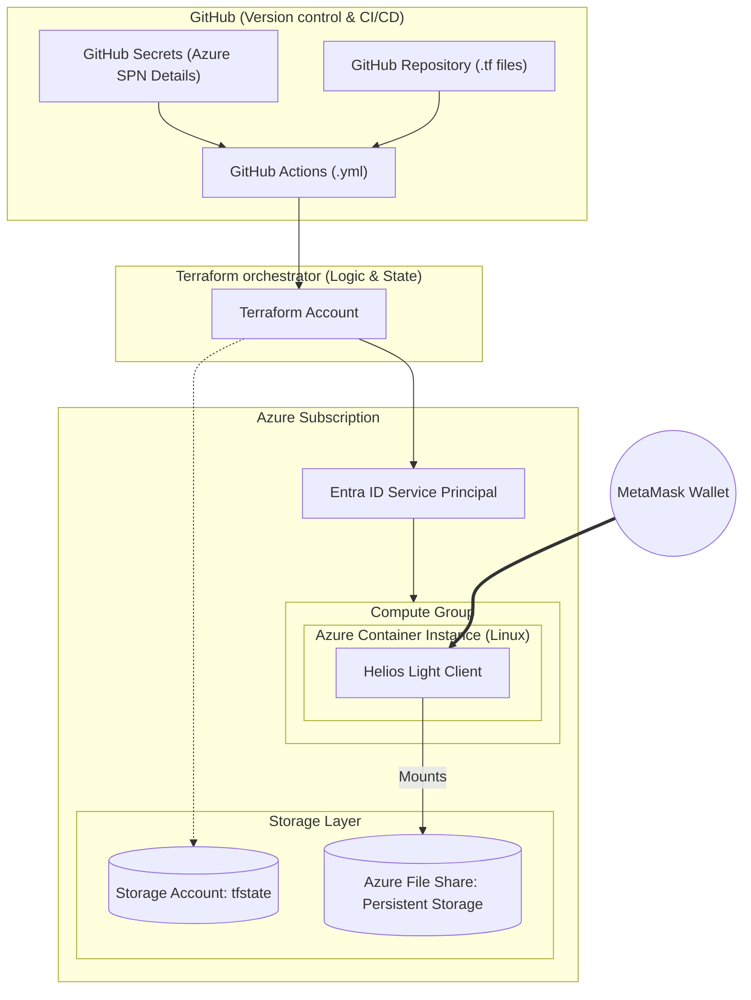
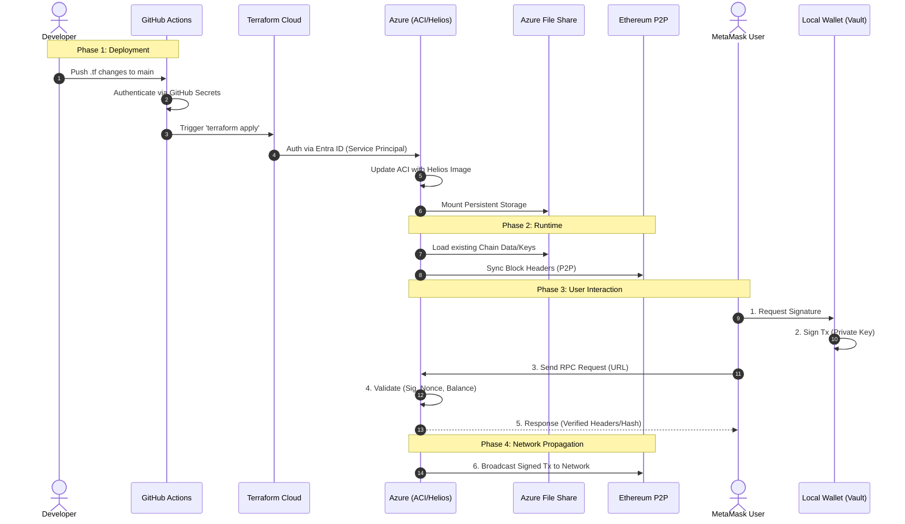

# High Level Design

## Purpose and scope of this document
This high level design specifies all relevant components of the proposed solution, their interactions and other relevant considerations such as risks and assumptions without needing to disclose implemented code or configuration settings. It aims to give the reader, in not overly technical terms, an understanding of what will be implemented and how it will work. It is necessary to describe, at an early stage, the actors in the system and the relationship between them, hence the entity relationship diagram. After that the flow of data between the entities is described. Once we are clear on the basic description of the system, we begin to examine the various components of the system and how they fit together, this is done using the components list and the high level architecture diagram. A sequence diagram describes the lifecycle of the system including user interactions. High level constraints describe the technical limitations within which the system is designed. In addition to the logical architecture, an overview of network security and monitoring is also given. These sections constitute the high level design, which aims to give a full description of the proposed system.

## Entity relationship diagram

### Diagram explanation
1. **User to Wallet:**
An individual user acts as the owner of their private keys. A User must exist for a Wallet to be managed, but a new User might not have created a Wallet yet (hence "Zero or Many"). However, a Wallet is logically tied to exactly one owner for accountability and access control.

2. **Wallet to Transaction:**
The Wallet uses its private key to digitally sign data payloads, transforming them into valid Ethereum transactions. A single Wallet can generate an infinite history of Transactions. Conversely, every Transaction must be signed by exactly one Wallet to be valid on the blockchain; a transaction cannot exist without a source address and a signature.

3. **Transaction to Light Client:**
The signed Transaction is sent to the Light Client. A Light Client acts as a gateway; it can receive many different transactions from various sources. From the perspective of the Transaction, it is submitted to one specific node to enter the network, though it may eventually exist on all nodes.

4. **Light Client to Ethereum Node Network:**
The Light Client maintains active P2P (Peer-to-Peer) connections to sync block headers and broadcast transactions. It maintains connections to many peers (Full Nodes) simultaneously.

## Data flow diagram

### Explanation of data flow diagram

The user and the wallet creates a signed request which is sent to the light node for validation. If the transaction is formatted correctly, the user can be verified, and has enough funds, the transaction is then broadcast to the Ethereum network by the light node. The transaction is added to the Mempool where it waits to ultimately be processed, any relevant code is executed and resulting state changes are added to a new block. The light client receives a copy of the relevant block headers to update its local state.

| Process | Input | Output | Logic / Transformation |
| :--- | :--- | :--- | :--- |
| **1.0 Sign Transaction** | Intent & Private Key | Signed Tx Payload | The Wallet retrieves the private key to apply a cryptographic signature to the transaction parameters (nonce, gas, data). |
| **2.0 Validate & Submit** | Signed Tx Payload | Validated Raw Tx | The Light Client verifies the signature and ensures the transaction format adheres to network standards (e.g., EIP-1559) before submission. |
| **3.0 Broadcast & Sync** | Validated Raw Tx | Network Propagation | The Light Client pushes the transaction to connected peers via Gossip protocol and receives Block Headers to update the local state. |

## Basic high level components
- Metamask Wallet
- GitHub repository for .tf files
- GitHub Actions workflow file (.yml) : defines the actions that perform the Terraform workflow.
- GitHub secrets : Storing the Azure Service Principle details.
- Terraform account : Terraform will check the code against the state file, prepare the deployment and push the changes to Azure.
- Azure subscription 
- Azure Entra ID service principle : to allow GitHub to run the Terraform code.
- Azure storage account : Keeps the Terraform state file.
- Azure container instance (Linux)
- Azure file share : Persistent storage for the Azure container.
- Helios light client (running in the Azure Container Instance)

## System Architecture Diagram (Physical/Cloud)

## Sequence diagram

### Explanation of sequence diagram
Operational Process Flow
The lifecycle of the Helios Light Client system is categorized into three distinct phases: Infrastructure Orchestration, Runtime Initialization, and Client Interaction.

1. Infrastructure Orchestration (CI/CD)
The process begins when a developer pushes updated Terraform configurations to the GitHub repository.

Authentication: GitHub Actions retrieves the Azure Service Principal credentials from GitHub Secrets to establish a secure session with the cloud environment.

State Management: Terraform Cloud calculates the "diff" between the current infrastructure and the desired state. It communicates with the Azure Storage Account to update the state file, ensuring a "single source of truth."

Provisioning: Upon approval, Terraform issues commands to the Azure Resource Manager to deploy or update the Azure Container Instance (ACI).

2. Runtime Initialization & Persistence
Once the container is provisioned, the Helios binary starts within the Linux environment.

Volume Mounting: The ACI mounts the Azure File Share using the SMB protocol. This allows the Helios client to access persistent data (such as synced headers and local database files) that survives container restarts.

Network Synchronization: Helios initiates a P2P handshake with the Ethereum network. It begins tracking the Sync Committee and downloading the latest block headers to ensure it is at the "head" of the chain.

3. User Interaction (The RPC Loop)
The final phase represents the steady-state operation where the system provides value to the end-user.

Request Handling: A user (via MetaMask) sends a JSON-RPC request to the ACI's public IP/FQDN.

Verification: Helios does not blindly trust the data. It retrieves the necessary Merkle proofs from the P2P network, verifies them against its locally stored trusted headers, and returns a cryptographically secured response to the user.

Security Note
Note: All communication between GitHub, Terraform, and Azure is encrypted in transit via TLS 1.2+. The Service Principal follows the Principle of Least Privilege, granted only the specific permissions required to manage the ACI and Storage Account resources.

## Assumptions
In any High-Level Design, documenting assumptions is critical because it defines the "guardrails" of your solution. If any of these change, the architecture might need a redesign.

Here are the primary assumptions we’ve baked into this Helios-on-Azure architecture:

1. Connectivity & Accessibility
Public Reachability: We assume the Azure Container Instance (ACI) will be assigned a Public IP address or a Fully Qualified Domain Name (FQDN) so that MetaMask can reach the Helios RPC endpoint.

Provider Support: We assume MetaMask (or the user) is configured to use a Custom RPC URL pointing to your ACI instance rather than a standard provider like Infura.

2. Security & Identity
Stateless Secrets: We assume the Azure Service Principal has been granted the Contributor or a custom Network/Contributor role at the Resource Group level, and that these credentials are securely rotated within GitHub Secrets.

Unauthenticated RPC: By default, Helios provides an open RPC port. We are assuming for this high-level view that additional layers (like an Nginx sidecar with Basic Auth or an Azure API Management gateway) are either out of scope or not yet required.

3. Persistence & Performance
SMB Compatibility: We assume the Helios binary (running in Linux) is compatible with mounting Azure File Shares via the SMB protocol for persistent storage.

Clock Sync: Light clients are sensitive to time. We assume the underlying Azure host maintains an accurate system clock (via NTP) for block header validation.

4. Ethereum Network Protocol
P2P Openness: We assume Azure’s Network Security Group (NSG) allows outbound traffic on Ethereum P2P ports (usually 30303) and Discovery ports (9000 for consensus layer) so Helios can find peers.

Checkpoint Trust: We assume the developer provides a trusted Weak Subjectivity Checkpoint (a recent block hash) in the Terraform configuration to allow Helios to sync securely and quickly.

## Technical constraints

| Category       | Constraint       | Requirement / Value               | Reason                                                                 |
|:---------------|:-----------------|:----------------------------------|:----------------------------------|
| **Compute** | Memory (RAM)     | Min. 2GB                          | Handles P2P networking overhead and cryptographic signature verification. |
| **Compute** | CPU              | 1 vCPU (Linux)                    | Helios is efficient; a single core is sufficient for light client header syncing. |
| **Storage** | Persistence      | Azure File Share (SMB)            | Ensures the client doesn't re-sync the entire header chain on container restart. |
| **Storage** | Capacity         | 5GB - 10GB                        | Plenty of overhead for the header database and local logs.             |
| **Networking** | Inbound Port     | 8545 (TCP)                        | Default RPC port for MetaMask/User communication.                      |
| **Networking** | Outbound Ports   | 30303 (TCP) / 9000 (UDP)          | Required for Ethereum execution and consensus layer peer discovery.    |
| **Authentication**| IAM           | Entra ID Service Principal        | Required for GitHub Actions to manage Azure resources via Terraform.    |

## Networking Security

## Monitoring