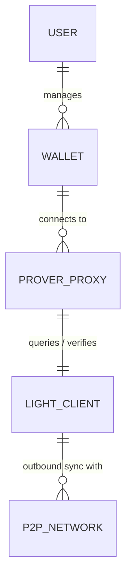
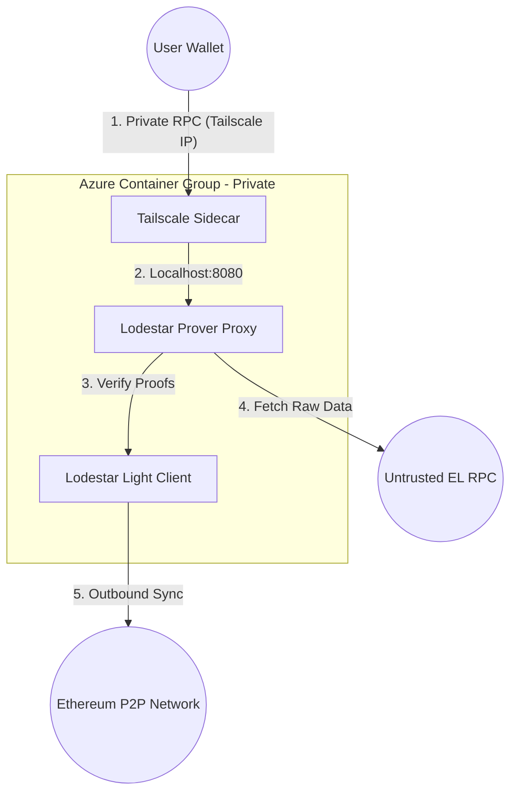
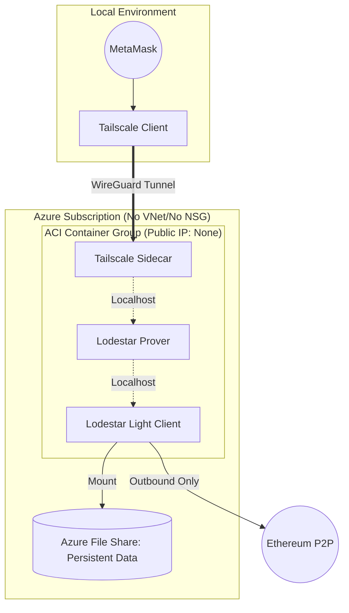
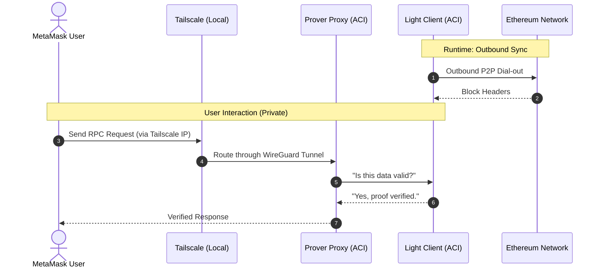

# High Level Design

## Purpose and scope of this document
This high level design specifies all relevant components of the proposed solution, their interactions and other relevant considerations such as risks and assumptions without needing to disclose implemented code or configuration settings. It aims to give the reader, in not overly technical terms, an understanding of what will be implemented and how it will work. It is necessary to describe, at an early stage, the actors in the system and the relationship between them, hence the entity relationship diagram. After that the flow of data between the entities is described. Once we are clear on the basic description of the system, we begin to examine the various components of the system and how they fit together, this is done using the components list and the high level architecture diagram. A sequence diagram describes the lifecycle of the system including user interactions. High level constraints describe the technical limitations within which the system is designed. In addition to the logical architecture, an overview of network security and monitoring is also given. These sections constitute the high level design, which aims to give a full description of the proposed system.

## Basic description of system

### Diagram explanation
1. **User to Wallet:**
An individual user acts as the owner of their private keys. A User must exist for a Wallet to be managed, but a new User might not have created a Wallet yet (hence "Zero or Many"). However, a Wallet is logically tied to exactly one owner for accountability and access control.

2. **Wallet to Prover Proxy:**
The Wallet uses its private key to digitally sign data payloads, transforming them into valid Ethereum transactions. A single Wallet can generate an infinite history of Transactions. Conversely, every Transaction must be signed by exactly one Wallet to be valid on the blockchain; a transaction cannot exist without a source address and a signature. The wallet connects to a secure RPC endpoint provided by the Prover Proxy over a private Tailscale tunnel.

3. **Prover Proxy to Light Client:**
The wallet connects to a secure RPC endpoint provided by the Prover Proxy over a private Tailscale tunnel.

4. **Light Client to P2P Network:**
The node performs outbound-only connections to Ethereum peers to stay synced.
## Data flow diagram

### Explanation of data flow diagram

The user and the wallet creates a signed request which is sent to the light node for validation. If the transaction is formatted correctly, the user can be verified, and has enough funds, the transaction is then broadcast to the Ethereum network by the light node. The transaction is added to the Mempool where it waits to ultimately be processed, any relevant code is executed and resulting state changes are added to a new block. The light client receives a copy of the relevant block headers to update its local state.

| Process | Input | Output | Logic / Transformation |
| :--- | :--- | :--- | :--- |
| **1.0 Sign Transaction** | Intent & Private Key | Signed Tx Payload | The Wallet retrieves the private key to apply a cryptographic signature to the transaction parameters (nonce, gas, data). |
| **2.0 Validate & Submit** | Signed Tx Payload | Validated Raw Tx | The Light Client verifies the signature and ensures the transaction format adheres to network standards (e.g., EIP-1559) before submission. |
| **3.0 Broadcast & Sync** | Validated Raw Tx | Network Propagation | The Light Client pushes the transaction to connected peers via Gossip protocol and receives Block Headers to update the local state. |

## Basic high level components

- MetaMask/Rabby Wallet: The user interface for signing transactions.
- Azure Container Instance (ACI): The serverless compute host.
- Lodestar Light Client: The consensus-layer node.
- Lodestar Prover Proxy: The "bridge" that allows wallets to talk to the light client.
- Tailscale Sidecar: Provides the secure, private entry point (No Public IP needed).
- Azure File Share: Persistent storage for the node's database.
- Infura/Alchemy (Optional): Used as an untrusted data source by the Prover (verified by your node).

## System Architecture Diagram (Physical/Cloud)

## High Level System Processes

### Explanation of system processes
Operational Process Flow
Phase 1: Deployment – The Developer uses an automated "Infrastructure as Code" pipeline. When changes are pushed to GitHub, Terraform Cloud authenticates with Azure to deploy or update the Light Node (Lodestar) within a container. This phase ensures the environment is consistent and uses persistent storage to keep the node's history.

Phase 2: Runtime – Once the container is live, the Light Node begins its background work. It loads any existing data from the file share and connects to the Ethereum P2P Network to sync the latest block headers. This creates a trusted, up-to-date window into the blockchain without needing to download the entire database.

Phase 3: User Interaction – This is the active loop between the user and their node. The MetaMask User signs a transaction locally (keeping their keys private), then sends that signed request to the Azure Light Node via an RPC URL. The node validates the transaction against its synced headers and sends back a response, giving the user immediate, verified confirmation.

Phase 4: Network Propagation – After the Light Node confirms the transaction is valid, it acts as a gateway to the rest of the world. it broadcasts the signed payload to the broader Ethereum P2P Network, where it enters the mempool to be picked up by validators and permanently recorded in a block.

## Assumptions
Here are the primary assumptions for this architecture:

**No Inbound Discovery**: Because the node has no Public IP, it cannot be discovered by others. It must initiate all connections.

**Tailscale Requirement**: The user must have Tailscale running on their local machine to "see" the node.

**Outbound NAT**: We assume the Azure ACI platform provides default outbound internet access (NAT) for peer synchronization.

**Compute**: 2 vCPU and 2GB RAM (Required to handle the three-container group: Lodestar, Prover, and Tailscale).

**Metamask** MetaMask must connect via the Tailscale tunnel (private IP/DNS), as the scenario forbids public RPC exposure.

**Provider Support:** We assume MetaMask (or the user) is configured to use a Custom RPC URL pointing to your ACI instance rather than a standard provider like Infura.

**Role Based Access Control:** We assume the Azure Service Principal has been granted the Contributor or a custom Network/Contributor role at the Resource Group level, and that these credentials are securely rotated within GitHub Secrets.

**SMB Compatibility:** We assume the Lodestar binary (running in Linux) is compatible with mounting Azure File Shares via the SMB protocol for persistent storage.

**Clock Sync:** Light clients are sensitive to time. We assume the underlying Azure host maintains an accurate system clock (via NTP) for block header validation.

**Checkpoint:** The developer can provide a trusted Weak Subjectivity Checkpoint (a recent block hash) in the Terraform configuration to allow Lodestar to sync securely and quickly. Also that the checkpoint can be updated, saved and can be used to resync the light node after a shutdown of any length.

## Technical constraints

| Category       | Constraint       | Requirement / Value               | Reason                                                                 |
|:---------------|:-----------------|:----------------------------------|:----------------------------------|
| **Compute** | Memory (RAM)     | Min. 2GB                          | Handles P2P networking overhead and cryptographic signature verification. |
| **Compute** | CPU              | 1 vCPU (Linux)                    | Lodestar is efficient; a single core is sufficient for light client header syncing. |
| **Storage** | Persistence      | Azure File Share (SMB)            | Ensures the client doesn't re-sync the entire header chain on container restart. |
| **Storage** | Capacity         | 5GB - 10GB                        | Plenty of overhead for the header database and local logs.             |
| **Networking** | Outbound Ports   | 30303 (TCP) / 9000 (UDP)          | Required for Ethereum execution and consensus layer peer discovery.    |
| **Authentication**| IAM           | Entra ID Service Principal        | Required for GitHub Actions to manage Azure resources via Terraform.    |

## Security considerations

### Networking security
We only want to allow inbound RPC traffic from our metamask wallet to the container running the light node. We only want to allow outbound Ethereum based traffic between the light node and its peers. All other traffic should be blocked.

This architecture eliminates the primary attack vector for cloud-hosted nodes.

Zero Public Surface: By setting ip_address_type = "None" (or keeping it "Public" but removing all ports from the public interface in Terraform), there is no IP address for a hacker to scan.

Mesh Isolation: Access is restricted to members of your Tailscale "Tailnet." Authentication is handled at the identity level, not the network level.

Localhost Only: The Lodestar Admin API and Prover Proxy are configured to listen on 127.0.0.1, ensuring they only respond to the Tailscale sidecar within the same container group.

## Monitoring

Azure Container Apps environments provide centralized logging capabilities through integration with Azure Monitor and Application Insights.

By default, all container apps within an environment send logs to a common Log Analytics workspace, making it easier to query and analyze logs across multiple apps. These logs include:

Container stdout/stderr streams
Container app scaling events
Dapr sidecar logs (if Dapr is enabled)
System-level metrics and events