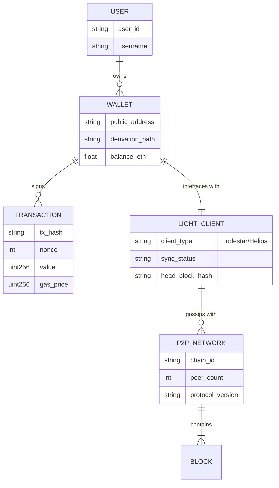

# High Level Design

## High level solution
### Entity relationship diagram

```mermaid
erDiagram
    USER ||--o{ WALLET : "owns"
    WALLET ||--o{ TRANSACTION : "signs"
    WALLET ||--|| LIGHT_CLIENT : "interfaces with"
    LIGHT_CLIENT ||--o{ P2P_NETWORK : "gossips with"
    P2P_NETWORK ||--|{ BLOCK : "contains"
    
    USER {
        string user_id
        string username
    }
    
    WALLET {
        string public_address
        string derivation_path
        float balance_eth
    }

    LIGHT_CLIENT {
        string client_type "Lodestar/Helios"
        string sync_status
        string head_block_hash
    }

    P2P_NETWORK {
        string chain_id
        int peer_count
        string protocol_version
    }

    TRANSACTION {
        string tx_hash
        int nonce
        uint256 value
        uint256 gas_price
    }

```

