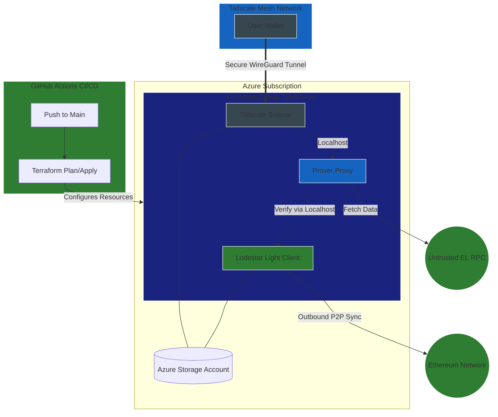
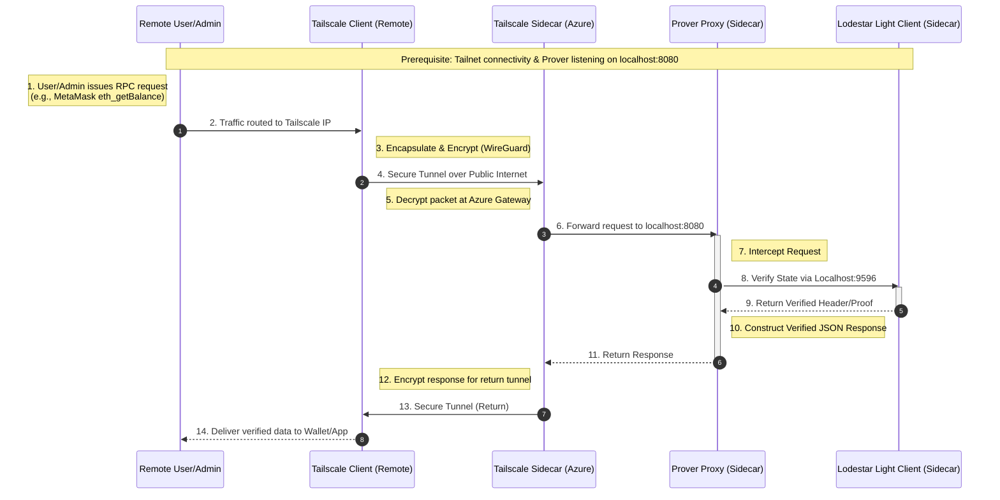
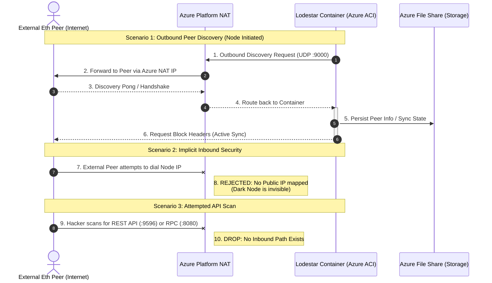

# Low level design

    - Detailed description of component configuration
    - Sequence diagrams for protocol interactions
    - Detailed breakdown of costs
    - Detailed description of security risks and mitigations
    - Detailed implementation steps
    - Detailed testing procedure

## Detailed component description


## Description of solution
This architecture implements a highly secure, cost-optimized Ethereum light node using a "Dark Node" pattern within Azure Container Instances (ACI). By eliminating the Virtual Network (VNet), Network Security Groups (NSG), and Public IP address, the solution reduces the cloud infrastructure footprint to its absolute minimum, significantly lowering monthly Azure costs and removing the public attack surface.

The solution is orchestrated as a single ACI Container Group containing three specialized functional sidecars:

Lodestar Light Client: The core consensus engine that performs outbound-only synchronization with the Ethereum P2P network. It maintains a trust-minimized view of the blockchain by syncing headers and verifying data availability.

Lodestar Prover Proxy: A specialized RPC bridge that listens on the container group’s internal loopback interface. It intercepts standard JSON-RPC requests from user wallets and cryptographically verifies the data against the Light Client before responding, providing "Infura-speed with local-node security."

Tailscale Sidecar: The sole entry point for management and interaction. It establishes an encrypted WireGuard tunnel to the user’s private mesh network (Tailnet). This allows the user to interact with the Prover Proxy via a private Tailscale IP or MagicDNS name, ensuring the node remains completely invisible to the public internet.

The entire stack is deployed as Infrastructure as Code (IaC) using Terraform, with state managed in a secure Azure Storage account. Persistence is handled via an Azure File Share mount, ensuring that both Ethereum chain segments and Tailscale identity state persist across container restarts. This design achieves the project's primary goal: a functional, verified Ethereum interface that is "dark" by default, secure by design, and optimized for a restricted budget.
## Low level diagram of solution




### Terraform Configuration (main.tf)

This configuration uses a Multi-Container Group. Lodestar runs the node, and Tailscale provides the secure tunnel for a remote connection. Azure Files is utilized to persist the node state and Tailscale's identity.

```terraform
# main.tf (Updated for Dark Node Architecture)

resource "azurerm_resource_group" "eth_node" {
  name     = "rg-lodestar-node"
  location = var.location
}

# 1. Storage (Persistent data for Lodestar and Tailscale state)
resource "azurerm_storage_account" "storage" {
  name                     = "stlodestardata${random_string.suffix.result}"
  resource_group_name      = azurerm_resource_group.eth_node.name
  location                 = azurerm_resource_group.eth_node.location
  account_tier             = "Standard"
  account_replication_type = "LRS"
}

resource "azurerm_storage_share" "lodestar_share" {
  name                 = "lodestar-data"
  storage_account_name = azurerm_storage_account.storage.name
  quota                = 10
}

# 2. Container Group (Dark Node - No VNet, No Public IP)
resource "azurerm_container_group" "node_group" {
  name                = "lodestar-dark-node"
  location            = azurerm_resource_group.eth_node.location
  resource_group_name = azurerm_resource_group.eth_node.name
  os_type             = "Linux"

  # "None" removes the public IP entirely. 
  # Note: ACI still has outbound internet access via platform NAT for peer syncing.
  ip_address_type     = "None"

  # Lodestar Light Client Container
  container {
    name   = "lodestar"
    image  = "chainsafe/lodestar:latest"
    cpu    = "0.5"
    memory = "1.5"

    ports {
      port     = 9596
      protocol = "TCP"
    }

    commands = [
      "node", "light-client",
      "--network", "sepolia",
      "--checkpointSyncUrl", "https://checkpoint-sync.sepolia.ethpandaops.io/",
      "--rest",
      "--rest.address", "127.0.0.1", # Only listen to internal sidecars
      "--rest.port", "9596",
      "--rootDir", "/data"
    ]

    volume {
      name                 = "lodestar-storage"
      mount_path           = "/data"
      share_name           = azurerm_storage_share.lodestar_share.name
      storage_account_name = azurerm_storage_account.storage.name
      storage_account_key  = azurerm_storage_account.storage.primary_access_key
    }
  }

  # Lodestar Prover Proxy (Allows MetaMask to connect)
  container {
    name   = "prover"
    image  = "chainsafe/lodestar:latest"
    cpu    = "0.5"
    memory = "1.0"

    commands = [
      "prover", "proxy",
      "--network", "sepolia",
      "--beaconUrls", "http://127.0.0.1:9596",
      "--executionRpcUrl", var.infura_url, # Untrusted data source to be verified
      "--port", "8080",
      "--address", "0.0.0.0" # Accessible to Tailscale via localhost/shared namespace
    ]
  }

  # Tailscale Sidecar (The secure entry point)
  container {
    name   = "tailscale"
    image  = "tailscale/tailscale:latest"
    cpu    = "0.5"
    memory = "0.5"

    environment_variables = {
      TS_AUTHKEY   = var.tailscale_key
      TS_STATE_DIR = "/var/lib/tailscale"
      TS_EXTRA_ARGS = "--hostname=eth-light-node"
      TS_USERSPACE = "true"
    }

    volume {
      name                 = "tailscale-state"
      mount_path           = "/var/lib/tailscale"
      share_name           = azurerm_storage_share.lodestar_share.name
      storage_account_name = azurerm_storage_account.storage.name
      storage_account_key  = azurerm_storage_account.storage.primary_access_key
    }
  }
}

resource "random_string" "suffix" {
  length  = 6
  special = false
  upper   = false
}

variable "infura_url" {
  description = "The untrusted Execution Layer RPC URL (Infura/Alchemy)"
  type        = string
}

variable "tailscale_key" {
  description = "Tailscale Auth Key"
  type        = string
  sensitive   = true
}

```

### GitHub Actions Workflow (deploy.yml)
To automate the deployment of the solution, Azure credentials and Tailscale key are stored in GitHub Secrets.

Azure Service Principal: Created using az ad sp create-for-rbac and save the JSON as AZURE_CREDENTIALS.

Tailscale Key: Created with an Auth Key (reusable recommended) in the Tailscale dashboard and saved as TAILSCALE_KEY.

```yaml
YAML
name: Deploy Lodestar Node

on:
  push:
    branches: [ main ]

jobs:
  terraform:
    runs-on: ubuntu-latest
    env:
      ARM_CLIENT_ID: ${{ secrets.AZURE_CLIENT_ID }}
      ARM_CLIENT_SECRET: ${{ secrets.AZURE_CLIENT_SECRET }}
      ARM_SUBSCRIPTION_ID: ${{ secrets.AZURE_SUBSCRIPTION_ID }}
      ARM_TENANT_ID: ${{ secrets.AZURE_TENANT_ID }}

    steps:
      - uses: actions/checkout@v4

      - name: Setup Terraform
        uses: hashicorp/setup-terraform@v3

      - name: Terraform Init
        run: terraform init

      - name: Terraform Apply
        run: terraform apply -auto-approve \
          -var="tailscale_key=${{ secrets.TAILSCALE_KEY }}"
          -var="infura_url=${{ secrets.INFURA_URL }}"
```

### GitHub Repository Structure


```Plaintext
.
├── .github/workflows/deploy.yml  # GitHub Actions CI/CD
├── main.tf                       # Terraform: ACI, Storage, and Logic
├── variables.tf                  # Variable definitions
├── outputs.tf                    # IP and Connection info
└── providers.tf                  # Azure provider config

```

## Sequence diagrams for protocol interactions

### Sequence diagram for remote admin



### Sequence diagram for internet to Lodestar Client.


## Detailed breakdown of costs
## Detailed description of security risks and mitigations

### Security Risk Assessment (Dark Node Architecture)

The attack surface is now primarily shifted from **Inbound Network Attacks** to **Outbound/Supply Chain Risks**. The exposure is divided into three vectors:

* **The Trusted Proxy (Internal Loopback):** The Lodestar Prover is now a "Man-in-the-Middle" between your wallet and the light client. If this process is compromised, it could return fraudulent transaction data.
* **The Supply Chain (Container Group):** With three containers (`lodestar`, `prover`, `tailscale`) sharing a single network namespace and disk mount, a vulnerability in any one image can compromise the entire group.
* **Outbound Data Leakage:** While peers cannot find you, your node still connects to them. This leaks your Azure Instance's existence and metadata to the global Ethereum DHT.

---

### Potential Attack Scenarios

#### A. Eclipse Attacks (Outbound)
Even without a public IP, your node must "reach out" to find peers. An attacker who controls a large number of nodes could still attempt to "eclipse" your light client if you happen to connect exclusively to their malicious nodes. Without a public ENR for others to find you, you rely entirely on your node's ability to pick "honest" peers from the bootstrap list.

#### B. The "Internal Pivot" (Sidecar Escape)
Since all three containers share the same **localhost** and **File Share**, they are in the same trust zone. If the Prover Proxy (which talks to an untrusted external Execution RPC like Infura) is exploited, an attacker could pivot to the Tailscale container to access your private mesh network or manipulate the Lodestar client's state.

#### C. Credential/Identity Cloning
If your Azure Storage Account keys are leaked, an attacker can download the `tailscale-state` from the file share. They could then impersonate your node on your private Tailnet, potentially intercepting your wallet's transactions or gaining access to other devices in your mesh.

---

### Risk Mitigation Strategy

To harden this "Dark" setup, we implement a **Zero-Trust Sidecar** strategy:

### 1. Infrastructure & Storage Hardening
* **Storage Firewalls:** Configure the Storage Account to **"Enabled from selected virtual networks and IP addresses."** Since we are not using a VNet, restrict access to the specific Azure Service Principal or use **Private Endpoints** if budget allows later.
* **Managed Identities:** Avoid using Storage Access Keys in the Terraform code. Use a **System-Assigned Managed Identity** for the ACI to authenticate to the File Share.
* **Disk Isolation:** If possible, use separate sub-folders or separate File Shares for Lodestar data and Tailscale state to prevent a compromised container from accessing all persistent data.

### 2. Network & Proxy Security
* **Localhost Binding:** Explicitly bind the Lodestar REST API (`--rest.address 127.0.0.1`) and the Prover Proxy to loopback. This ensures that even if an Azure networking error occurred, these ports are never reachable outside the container group.
* **Tailscale ACLs (Identity-Based):** In the Tailscale console, use **Tags** (e.g., `tag:eth-node`). Set an ACL rule that allows `YOUR_USER` to access `tag:eth-node` on **Port 8080 only**. The node should have no permission to initiate traffic to any other device on your Tailnet.
* **Prover Verification:** Always verify the `infura_url` (Execution Layer) is using **HTTPS** to prevent MITM attacks on the data the Prover is trying to verify.

### 3. Supply Chain & Lifecycle
* **Image Pinning (SHA256):** Do not use `:latest`. Pin `chainsafe/lodestar` and `tailscale/tailscale` to specific digest hashes. This ensures that a compromise of the Docker Hub repository does not automatically infect your node.
* **OIDC Authentication:** Transition GitHub Actions to use **Workload Identity Federation (OIDC)**. This removes the need to store long-lived `AZURE_CLIENT_SECRET` in GitHub, using short-lived tokens for each deployment instead.
* **Resource Balancing:** Allocate at least **2.5 GB RAM** to the container group. Running three processes (Lodestar, Prover, and Tailscale) creates higher memory pressure; a "Dark Node" that crashes frequently is more vulnerable to state corruption during resync.


## Detailed implementation steps
The transition to the **Dark Node** architecture significantly simplifies your Azure networking footprint (no VNets or NSGs) but adds a layer to your application stack (the Prover Proxy). 

Here are the updated implementation steps for your **Low Level Design (LLD)**.

---

## Detailed Implementation Steps (Dark Node Architecture)

### Phase 1: Bootstrapping & Identity
Build the Terraform management plane.

#### Step 1.0: Create the Target Resource Group
```bash
RG_NAME="rg-lodestar-node"
LOCATION="eastus" 
az group create --name $RG_NAME --location $LOCATION
```

#### Step 1.1: Azure Service Principal (SPN) Creation
```bash
az ad sp create-for-rbac --name "github-eth-node-sp" --role contributor \
  --scopes /subscriptions/{subscription-id}/resourceGroups/rg-lodestar-node \
  --sdk-auth
```

#### Step 1.2: Terraform Backend Setup
* **Action:** Create the Storage Account for state management.
```bash
STORAGE_NAME="stethterraformstate$(openssl rand -hex 4)"
az storage account create --name $STORAGE_NAME --resource-group rg-lodestar-node --location eastus --sku Standard_LRS
az storage container create --name tfstate --account-name $STORAGE_NAME
```

---

### Phase 2: Repository & Secret Management

#### Step 2.1: Secure Tailscale & Infura Secrets
1. **Tailscale:** Generate an **Auth Key** in the Tailscale Admin Console. 
   - **Settings:** Reusable = Yes, Ephemeral = Yes, Pre-authorized = Yes.
   - **Action:** Save to GitHub Secrets as `TAILSCALE_KEY`.
2. **Infura/Alchemy:** Create a free project and copy the **HTTPS Execution Layer URL** (e.g., `https://sepolia.infura.io/v3/...`).
   - **Action:** Save to GitHub Secrets as `INFURA_URL`.

#### Step 2.2: GitHub Secrets Injection
* **Action:** Populate GitHub Secrets with:
    * `AZURE_CLIENT_ID`, `AZURE_CLIENT_SECRET`, `AZURE_TENANT_ID`, `AZURE_SUBSCRIPTION_ID`
    * `TAILSCALE_KEY`
    * `INFURA_URL`

---

### Phase 3: Infrastructure Deployment (The "Dark" Apply)

#### Step 3.1: Terraform Apply
* **Action:** Trigger GitHub Actions to deploy the `main.tf` with `ip_address_type = "None"`.
* **Verification:** Navigate to the Azure Portal > Container Groups.
    * **Confirm:** The group exists.
    * **Confirm:** There is **no Public IP address** assigned to the instance.

---

### Phase 4: Container Orchestration & Networking

#### Step 4.1: Sidecar Initialization (Tailscale)
* **Action:** Monitor the Tailscale Admin Console.
* **Verification:** A new machine named `eth-light-node` should appear. Note its **Tailscale IP** (100.x.y.z).

#### Step 4.2: Lodestar & Prover Startup
* **Action:** Stream the logs for the three containers:
    ```bash
    # Check Light Client Sync
    az container logs -g rg-lodestar-node -n lodestar-dark-node --container-name lodestar
    # Check Prover Proxy Connectivity
    az container logs -g rg-lodestar-node -n lodestar-dark-node --container-name prover
    ```
* **Verification:** * `lodestar`: Look for `Verified transition to new sync committee`.
    * `prover`: Look for `Proxy server listening on port 8080`.

---

### Phase 5: Final Validation & Connectivity

#### Step 5.1: The "Verified RPC" Test
We verify that MetaMask/Rabby can talk to the **Prover**, which in turn talks to **Lodestar**.
* **Action:** On your local laptop (with Tailscale active), run:
    ```bash
    curl -X POST -H "Content-Type: application/json" \
      --data '{"jsonrpc":"2.0","method":"eth_blockNumber","params":[],"id":1}' \
      http://eth-light-node:8080
    ```
* **Verification:** You should receive a hex block number. This proves the "Dark Node" is fetching data from Infura and verifying it against your light client.

#### Step 5.2: Security Audit (Invisibility Test)
* **Action:** Attempt to ping or port scan your Azure Resource Group's internal IP from outside Tailscale.
* **Verification:** The node should be **unreachable**. There is no public path to the node; it only exists within your private mesh.

---

### Engineering Observations & Tips for Dark Nodes
* **Resource Balancing:** You have 3 containers now. Ensure you have allocated at least **2.0GB - 2.5GB RAM** total to the group to prevent the Prover and Lodestar from competing for memory during heavy sync periods.
* **Outbound Latency:** Since the node has no public IP, it relies on NAT. If you notice slow peer discovery, it's often due to Azure's SNAT port limits. Keeping the node running (High Uptime) allows it to maintain a stable pool of outbound peers.
* **MagicDNS:** If Tailscale MagicDNS is enabled, you can use `http://eth-light-node:8080` in MetaMask instead of the 100.x.y.z IP, which is much easier to manage.
