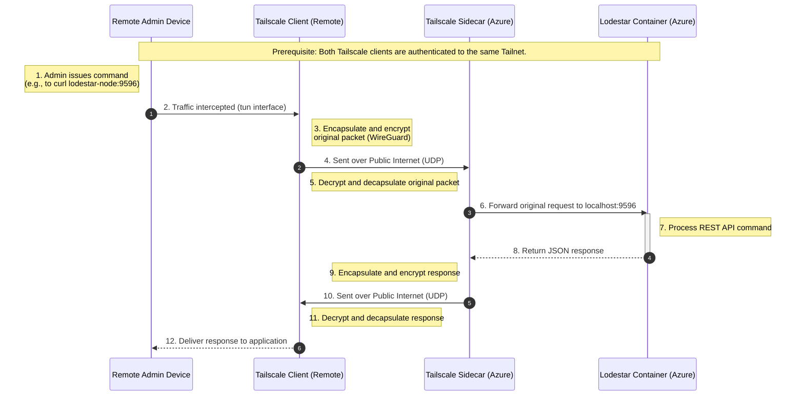
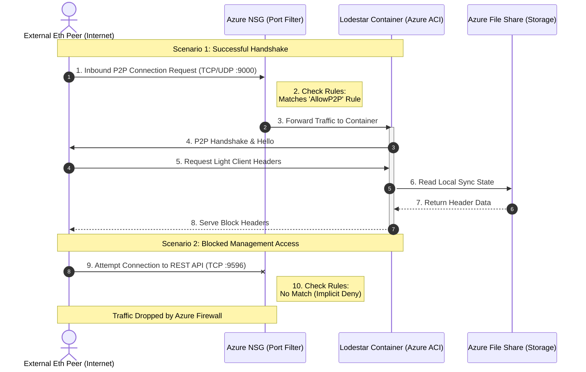

# Low level design

    - Detailed description of component configuration
    - Sequence diagrams for protocol interactions
    - Detailed breakdown of costs
    - Detailed description of security risks and mitigations
    - Detailed implementation steps
    - Detailed testing procedure

## Detailed component description


## Description of solution
This architecture implements a highly efficient, cloud-native Ethereum light node by leveraging a sidecar container pattern within Azure Container Instances (ACI) to balance public accessibility with private management. The primary Lodestar container functions as the Ethereum interface, utilizing a public IP for P2P network discovery on port 9000 while remaining synchronized via a persistent Azure File Share that prevents data loss during container recycling. 

Orchestrated alongside it, a Tailscale sidecar container establishes a secure, encrypted WireGuard tunnel, allowing remote administrators to securely access the node’s REST API on port 9596 via a private mesh network without exposing sensitive endpoints to the open internet. The entire lifecycle—from infrastructure provisioning via Terraform to automated deployments via GitHub Actions—is managed as code, ensuring a reproducible, low-overhead environment that maximizes security through network isolation and minimizes operational costs through right-sized serverless compute.

## Low level diagram of solution

```mermaid
graph TD
    subgraph GitHub_Actions [GitHub Actions CI/CD]
        A[Push to Main] --> B[Terraform Plan/Apply]
    end

    subgraph Azure_Cloud [Azure Subscription]
        direction TB
        
        subgraph VNet [Virtual Network: 10.0.0.0/16]
            direction TB
            
            %% NSG as a subtle blue rectangle
            NSG[Network Security Group]
            
            subgraph Subnet [ACI Subnet: 10.0.1.0/24]
                direction LR
                %% ACI Group in pastel green
                subgraph ACI [Container Group]
                    L[Lodestar Container]
                    T[Tailscale Sidecar]
                end
            end
        end

        SA[(Azure Storage Account)]
    end

    %% Deployment Flow
    B -- "Configures" --> VNet
    
    %% Internet Traffic Flow
    Internet((Internet)) -- "Port 9000" --> NSG
    NSG -- "Allow" --> L
    
    %% Storage Persistence
    L --- SA
    T --- SA

    %% Secure Management Flow
    Remote_User[Remote Admin] -. "WireGuard Tunnel" .-> T
    T -- "Localhost API" --> L

    %% Styling Updates
    style NSG fill:#e3f2fd,stroke:#90caf9,stroke-width:2px %% Subtle Blue
    style ACI fill:#e8f5e9,stroke:#a5d6a7,stroke-width:2px %% Pastel Green
    style VNet fill:#f5f5f5,stroke:#666
  
  ```


### Terraform Configuration (main.tf)

This configuration uses a Multi-Container Group. Lodestar runs the node, and Tailscale provides the secure tunnel for a remote connection. Azure Files is utilized to persist the node state and Tailscale's identity.

```Terraform
# main.tf (Updated with VNet and NSG)

resource "azurerm_resource_group" "eth_node" {
  name     = "rg-lodestar-node"
  location = var.location
}

# 1. Network: Virtual Network & Subnet
resource "azurerm_virtual_network" "vnet" {
  name                = "vnet-lodestar"
  address_space       = ["10.0.0.0/16"]
  location            = azurerm_resource_group.eth_node.location
  resource_group_name = azurerm_resource_group.eth_node.name
}

resource "azurerm_subnet" "aci_subnet" {
  name                 = "snet-aci"
  resource_group_name  = azurerm_resource_group.eth_node.name
  virtual_network_name = azurerm_virtual_network.vnet.name
  address_prefixes     = ["10.0.1.0/24"]

  # Required for ACI injection into a VNet
  delegation {
    name = "aci-delegation"
    service_delegation {
      name    = "Microsoft.ContainerInstance/containerGroups"
      actions = ["Microsoft.Network/virtualNetworks/subnets/action"]
    }
  }
}

# 2. Security: Network Security Group (NSG)
resource "azurerm_network_security_group" "aci_nsg" {
  name                = "nsg-lodestar-aci"
  location            = azurerm_resource_group.eth_node.location
  resource_group_name = azurerm_resource_group.eth_node.name

  # Allow Ethereum P2P (TCP)
  security_rule {
    name                       = "AllowP2P_TCP"
    priority                   = 100
    direction                  = "Inbound"
    access                     = "Allow"
    protocol                   = "Tcp"
    source_port_range          = "*"
    destination_port_range     = "9000"
    source_address_prefix      = "*"
    destination_address_prefix = "*"
  }

  # Allow Ethereum P2P (UDP)
  security_rule {
    name                       = "AllowP2P_UDP"
    priority                   = 110
    direction                  = "Inbound"
    access                     = "Allow"
    protocol                   = "Udp"
    source_port_range          = "*"
    destination_port_range     = "9000"
    source_address_prefix      = "*"
    destination_address_prefix = "*"
  }

  # Note: Port 9596 is NOT opened here. Tailscale handles it internally.
}

resource "azurerm_subnet_network_security_group_association" "nsg_assoc" {
  subnet_id                 = azurerm_subnet.aci_subnet.id
  network_security_group_id = azurerm_network_security_group.aci_nsg.id
}

# 3. Storage (Unchanged logic, added for completeness)
resource "azurerm_storage_account" "storage" {
  name                     = "stlodestardata${random_string.suffix.result}"
  resource_group_name      = azurerm_resource_group.eth_node.name
  location                 = azurerm_resource_group.eth_node.location
  account_tier             = "Standard"
  account_replication_type = "LRS"
}

resource "azurerm_storage_share" "lodestar_share" {
  name                 = "lodestar-data"
  storage_account_name = azurerm_storage_account.storage.name
  quota                = 5
}

# 4. Container Group (Updated for VNet)
resource "azurerm_container_group" "node_group" {
  name                = "lodestar-light-node"
  location            = azurerm_resource_group.eth_node.location
  resource_group_name = azurerm_resource_group.eth_node.name
  os_type             = "Linux"
  
  # Set to Private for VNet injection
  ip_address_type     = "Private"
  subnet_ids          = [azurerm_subnet.aci_subnet.id]

  container {
    name   = "lodestar"
    image  = "chainsafe/lodestar:latest"
    cpu    = "0.5"
    memory = "1.0"

    commands = [
      "node", "light-client",
      "--network", "mainnet",
      "--checkpointSyncUrl", "https://beaconstate.ethpandaops.io/",
      "--rest",
      "--rest.address", "0.0.0.0",
      "--rest.port", "9596",
      "--rootDir", "/data"
    ]

    ports {
      port     = 9000
      protocol = "TCP"
    }
    
    volume {
      name                 = "lodestar-storage"
      mount_path           = "/data"
      share_name           = azurerm_storage_share.lodestar_share.name
      storage_account_name = azurerm_storage_account.storage.name
      storage_account_key  = azurerm_storage_account.storage.primary_access_key
    }
  }

  container {
    name   = "tailscale"
    image  = "tailscale/tailscale:latest"
    cpu    = "0.1"
    memory = "0.2"

    environment_variables = {
      TS_AUTHKEY   = var.tailscale_key
      TS_STATE_DIR = "/var/lib/tailscale"
    }

    volume {
      name                 = "tailscale-state"
      mount_path           = "/var/lib/tailscale"
      share_name           = azurerm_storage_share.lodestar_share.name
      storage_account_name = azurerm_storage_account.storage.name
      storage_account_key  = azurerm_storage_account.storage.primary_access_key
    }
  }
}

resource "random_string" "suffix" {
  length  = 6
  special = false
  upper   = false
}
```

### GitHub Actions Workflow (deploy.yml)
To automate the deployment of the solution, Azure credentials and Tailscale key are stored in GitHub Secrets.

Azure Service Principal: Created using az ad sp create-for-rbac and save the JSON as AZURE_CREDENTIALS.

Tailscale Key: Created with an Auth Key (reusable recommended) in the Tailscale dashboard and saved as TAILSCALE_KEY.

```yaml
YAML
name: Deploy Lodestar Node

on:
  push:
    branches: [ main ]

jobs:
  terraform:
    runs-on: ubuntu-latest
    env:
      ARM_CLIENT_ID: ${{ secrets.AZURE_CLIENT_ID }}
      ARM_CLIENT_SECRET: ${{ secrets.AZURE_CLIENT_SECRET }}
      ARM_SUBSCRIPTION_ID: ${{ secrets.AZURE_SUBSCRIPTION_ID }}
      ARM_TENANT_ID: ${{ secrets.AZURE_TENANT_ID }}

    steps:
      - uses: actions/checkout@v4

      - name: Setup Terraform
        uses: hashicorp/setup-terraform@v3

      - name: Terraform Init
        run: terraform init

      - name: Terraform Apply
        run: terraform apply -auto-approve \
          -var="tailscale_key=${{ secrets.TAILSCALE_KEY }}"
```

### GitHub Repository Structure


```Plaintext
.
├── .github/workflows/deploy.yml  # GitHub Actions CI/CD
├── main.tf                       # Terraform: ACI, Storage, and Logic
├── variables.tf                  # Variable definitions
├── outputs.tf                    # IP and Connection info
└── providers.tf                  # Azure provider config

```

## Sequence diagrams for protocol interactions

### Sequence diagram for remote admin



### Sequence diagram for internet to Lodestar Client.


## Detailed breakdown of costs
## Detailed description of security risks and mitigations

While the Tailscale sidecar significantly hardens the management plane, the nature of Ethereum P2P networking necessitates some exposure.
The attack surface for this solution is divided into three distinct vectors:
* **Public P2P Interface (Port 9000):** This is your largest exposure. To participate in the Ethereum network, the node must be reachable by untrusted peers globally.
* **The Supply Chain:** This includes the Docker images (`chainsafe/lodestar`, `tailscale/tailscale`), the Terraform providers, and the GitHub Actions runner.
* **Azure Infrastructure Plane:** The Azure Portal/CLI access and the Storage Account keys. If the storage key is leaked, the Tailscale identity can be cloned, granting an attacker access to your private mesh network.

---

### Potential Attack Scenarios

#### A. Eclipse Attacks (P2P Level)
An attacker could attempt to surround your light node with malicious peers. By controlling all the nodes your light client connects to, they could feed you a dishonest version of the blockchain (e.g., hiding transactions or showing a stale state).

#### B. Resource Exhaustion / DoS
Because Port 9000 is open to the public, an attacker could flood the node with malformed discovery packets or high-volume connection requests. Given the low resource allocation ($0.5$ CPU, $1.0$ GB RAM), the ACI instance is highly susceptible to CPU pinning or OOM (Out of Memory) crashes.

#### C. Sidecar Escape or Data Exfiltration
If a vulnerability is found in the Lodestar binary, an attacker could theoretically compromise that container. From there, they might attempt to "hop" to the Tailscale container (since they share a network namespace) to intercept private traffic or access the shared Azure File Share to steal the Tailscale state keys.

---

### Risk Mitigation Strategy

To harden this setup, the following "Defense in Depth" measures are recommended:

### Infrastructure Hardening
* **Storage Account Firewalls:** Restrict the Storage Account so it only accepts traffic from the ACI's specific subnet or identity. Do not leave it open to "All Networks."
* **Use Managed Identities:** Instead of using the Storage Account Access Key in your Terraform (which is a "root" password for your data), configure ACI to use a **User-Assigned Managed Identity** to mount the file share.
* **Resource Quotas:** Consider bumping the memory to $2.0$ GB. Light clients are efficient, but during high network turbulence, memory spikes are common; a crash during a sync can lead to state corruption.

### Network & Sidecar Security
* **Tailscale ACLs:** Within the Tailscale admin console, implement **Tags** and **ACLs**. Ensure that the node can only *receive* traffic on port 9596 and cannot initiate connections to other sensitive devices on your Tailnet.
* **P2P Peer Limits:** Explicitly set `--maxPeers` in your Lodestar command. For a light node, $20–30$ peers is usually sufficient and prevents the container from being overwhelmed.

### Supply Chain Security
* **Image Pinning:** Instead of using `:latest`, pin your Docker images to specific hashes (SHA256). This prevents an "upstream" compromise of the image repository from automatically deploying malicious code to your Azure environment.
* **OIDC for GitHub Actions:** Stop using long-lived Azure Service Principal secrets. Switch to **OpenID Connect (OIDC)** to allow GitHub to authenticate to Azure via a short-lived, passwordless token.


## Detailed implementation steps


### Phase 1: Bootstrapping & Identity
Build the Terraform management plane

#### Step 1.0: Create the Target Resource Group
Since the SPN will be restricted to this group, it needs to exist beforehand. Run this in your Azure Cloud Shell:

```Bash
# Set your variables
RG_NAME="rg-lodestar-node"
LOCATION="eastus" # or your preferred region

# Create the Resource Group
az group create --name $RG_NAME --location $LOCATION
```

#### Step 1.1: Azure Service Principal (SPN) Creation
Create an identity for GitHub Actions.
Now, create the SPN and restrict its "Contributor" role strictly to that group. 
NOTE: replace {subscription-id}.

```Bash
az ad sp create-for-rbac --name "github-eth-node-sp" --role contributor \
  --scopes /subscriptions/{subscription-id}/resourceGroups/rg-lodestar-node \
  --sdk-auth
```

Verification: After running this, go to the Azure Portal > Resource Groups > rg-lodestar-node > Access Control (IAM). You should see "github-eth-node-sp" listed with the Contributor role for the resource group.

#### Step 1.2: Terraform Backend Setup
We need a place to store the `.tfstate` for GitHub Actions to keep track of resources.
* **Action:** Create a Terraform state Storage Account inside the same Resource Group (rg-lodestar-node).
In the Azure Cloud Shell run the following commands
```bash
# 1. Generate a unique name for your storage account (must be globally unique)
# This appends a random 4-character hex string to the name
STORAGE_NAME="stethterraformstate$(openssl rand -hex 4)"
RG_NAME="rg-lodestar-node"
LOCATION="eastus"

# 2. Create the storage account inside the scoped Resource Group
az storage account create \
  --name $STORAGE_NAME \
  --resource-group $RG_NAME \
  --location $LOCATION \
  --sku Standard_LRS \
  --encryption-services blob
  --enable-versioning true

# 3. Create the blob container for the state file
az storage container create \
  --name tfstate \
  --account-name $STORAGE_NAME

# 4. Display the name so you can copy it to your Terraform 'backend' config
echo "Your Terraform Storage Account Name is: $STORAGE_NAME"
```
Verification step
```bash
az storage account show --name $STORAGE_NAME --resource-group rg-lodestar-node --query "provisioningState"
```

---

### Phase 2: Repository & Secret Management
#### Step 2.1: Secure Tailscale Authentication

1. Create your Tailscale Account (if not already created)
- Go to tailscale.com.
- Click "Get Started for Free" or "Log in".
- Sign in using a "Single Sign-On" (SSO) provider. Tailscale doesn't use passwords; it uses your existing identity from GitHub, Google, or Microsoft.
Recommendation: Use the same GitHub account you are using for this project to keep your "DevOps" identity consistent.

2. Access the Admin Console
Once you are logged in, you will be taken to the Dashboard (this is the "Admin Console"). If you are on their homepage, there will be an "Admin Console" button in the top right corner.

3. Generate the Auth Key (The Step-by-Step)
Now that you're in the console:
- Click on the Settings tab in the top navigation bar.
- On the left-hand sidebar, click Keys.
- In the Auth keys section, click the Generate auth key... button.
- Configure the settings exactly like this:
- Description: Give it a name like azure-eth-node.
- Reusable: Check this box. Since containers in ACI might restart, you want the new container instance to be able to use the same key to re-join your network.
- Ephemeral: Check this box. This is a "cleanliness" feature. It tells Tailscale: "If this container goes offline and doesn't come back for a while, delete it from my dashboard automatically."
- Expiration: Set it to whatever you feel comfortable with (e.g., 90 days). You'll just need to update your GitHub Secret when it expires.
- Click Generate key.

4. Secure the Key
- Copy the key immediately (it starts with tskey-auth-...).
Warning: You will never see this key again once you close the pop-up.
- Action: Go straight to your GitHub Repository -> Settings -> Secrets and variables -> Actions and create a new secret named TAILSCALE_AUTH_KEY and paste the value there.


#### Step 2.2: GitHub Secrets Injection
* **Action:** Populate your GitHub Repository Secrets with:
    * `AZURE_CLIENT_ID`, `AZURE_CLIENT_SECRET`, `AZURE_TENANT_ID`, `AZURE_SUBSCRIPTION_ID`
    * `TAILSCALE_KEY`
* **Verification:** Create a dummy GitHub Action that prints "Secrets Loaded" (do not print the actual secrets!) to ensure the environment variables are mapping correctly.
1. Create the Workflow File
In your local repository (or directly in GitHub), create a new file at this exact path:
`.github/workflows/verify-secrets.yml`

2. Add the Test Code
Paste the following configuration into that file. This workflow doesn't install anything; it just checks if the "containers" for your secrets are populated.

```yaml
name: Verify Secrets Mapping

on: 
  workflow_dispatch: # This allows you to run it manually for testing

jobs:
  test-secrets:
    runs-on: ubuntu-latest
    steps:
      - name: Check Azure Credentials
        run: |
          if [ -n "${{ secrets.AZURE_CREDENTIALS }}" ]; then
            echo "✅ AZURE_CREDENTIALS is set."
          else
            echo "❌ AZURE_CREDENTIALS is MISSING."
            exit 1
          fi

      - name: Check Tailscale Key
        run: |
          if [ -n "${{ secrets.TAILSCALE_AUTH_KEY }}" ]; then
            echo "✅ TAILSCALE_AUTH_KEY is set."
          else
            echo "❌ TAILSCALE_AUTH_KEY is MISSING."
            exit 1
          fi

      - name: Verify Secret Format (Optional)
        run: |
          # This checks if the Azure secret looks like JSON without printing the contents
          echo "${{ secrets.AZURE_CREDENTIALS }}" | grep -q "clientId" && echo "✅ Azure JSON format looks correct." || echo "⚠️ Azure Secret might not be in the correct JSON format."
```


3. Run the Verification
- **Commit and Push** this file to your GitHub repository.
- Go to the **Actions** tab at the top of your GitHub repo page.
- On the left sidebar, click on **"Verify Secrets Mapping"**.
- Click the **"Run workflow"** dropdown button on the right and hit the green button.

4. Interpreting the Results
* **Green Checkmarks:** Your environment variables are correctly mapped. You are safe to proceed to the Terraform deployment.
* **Red "X":** GitHub cannot find the secret. This usually means there is a **typo** between the name you gave the secret in the "Settings" tab and the name you used in the YAML file (e.g., `TAILSCALE_KEY` vs `TAILSCALE_AUTH_KEY`).

### Why this is "Best Practice"
GitHub automatically masks secrets in logs (replacing them with `***`). However, if you accidentally echo a secret that isn't properly recognized as a secret, you could leak it to your logs. By using the `-n` (not empty) check in a shell script, we verify the **existence** of the data without ever risking the **exposure** of the data.

---

### Phase 3: Infrastructure Deployment (The "Apply" Phase)
#### Step 3.1: Terraform Initialization
* **Action:** Trigger the GitHub Action by pushing your `main.tf` and `variables.tf`.
* **Verification:** Check the **Terraform Init** logs in GitHub Actions to ensure the backend provider (Azure Storage) connects successfully.

#### Step 3.2: Resource Provisioning
* **Action:** Run the `terraform apply`.
* **Verification:** * Navigate to the Azure Portal. 
    * Verify the **Resource Group** exists.
    * Confirm the **Azure File Share** is created (this is critical for Lodestar's persistent database).

---

### Phase 4: Container Orchestration & Networking
#### Step 4.1: Sidecar Initialization (Tailscale)
Once ACI starts, the Tailscale container must join your "Tailnet."
* **Action:** Monitor the Tailscale Admin Console.
* **Verification:** A new machine (e.g., `lodestar-light-node`) should appear in your Tailscale dashboard with a **100.x.y.z** IP address.

#### Step 4.2: Lodestar Startup & Checkpoint Sync
The Lodestar container will start and attempt to sync using the `checkpointSyncUrl`.
* **Action:** Use the Azure CLI to stream logs:
    ```bash
    az container logs --resource-group rg-lodestar-node --name lodestar-light-node --container-name lodestar
    ```
* **Verification:** Look for the log line: `Verified transition to new sync committee`. This confirms the light client has successfully performed the "Weak Subjectivity" handshake.

---

### Phase 5: Final Validation & Connectivity
#### Step 5.1: The "Private Tunnel" Test
Now we verify that the RPC port (9596) is truly private but accessible to you.
* **Action:** On your local laptop (with Tailscale running), run a CURL command against the **Tailscale IP**:
    ```bash
    curl http://<Tailscale-IP>:9596/eth/v1/beacon/genesis
    ```
* **Verification:** You should receive a JSON response containing the Ethereum Genesis data.

#### Step 5.2: Public Port Scan (Security Audit)
* **Action:** Find the **Public IP** of your ACI in the Azure Portal. Use `nmap` or an online port scanner.
* **Verification:**
    * **Port 9000 (TCP/UDP):** Should be **Open** (required for P2P).
    * **Port 9596 (TCP):** Should be **Filtered/Closed** (successfully hidden by your architecture).

---

### Engineering Observations & Tips
* **Resource Throttling:** You allocated `0.5 CPU` to Lodestar. During the initial header sync, you might see 100% usage. If the container restarts frequently (OOM Killed), consider bumping memory to `1.5GB`.
* **Storage Performance:** Since you are using a Standard LRS File Share, the IOPS are limited. For a Light Client, this is fine. However, if you see "Database Timeout" in the logs, it’s likely the SMB latency.
* **Tailscale ACLs:** In your Tailscale dashboard, I recommend setting an ACL to only allow *your* specific laptop tag to talk to the node tag on port 9596.

This plan moves you from a static design to a living, breathing node. Ready to push the first commit?