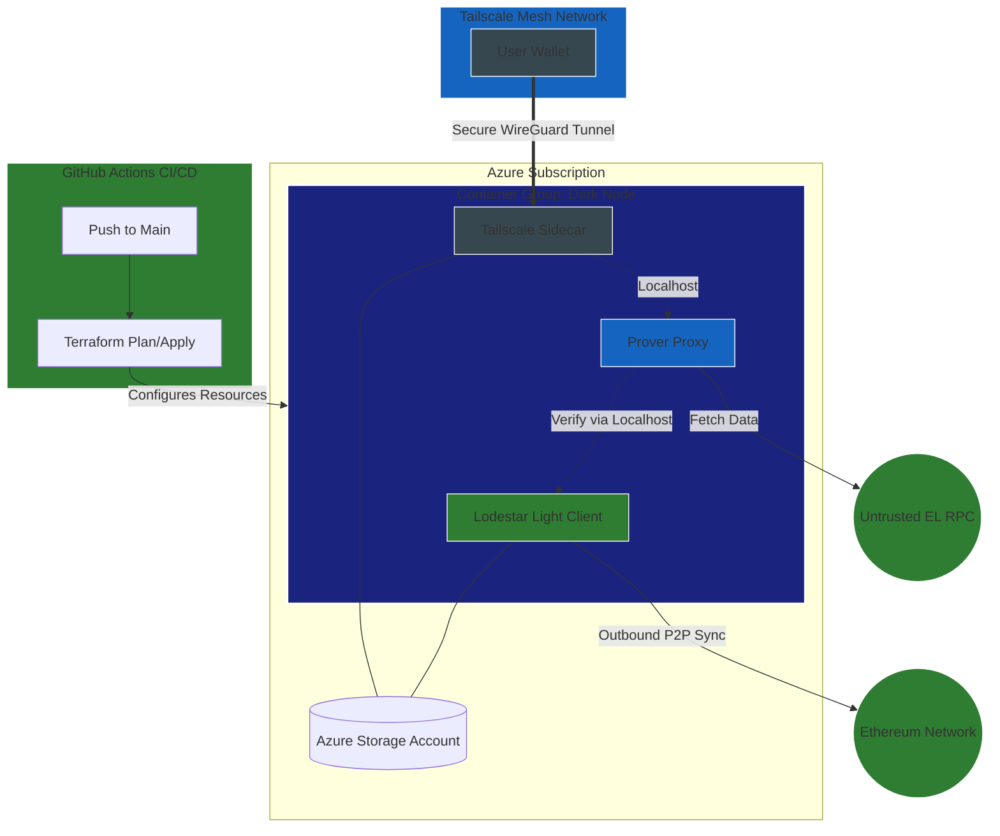
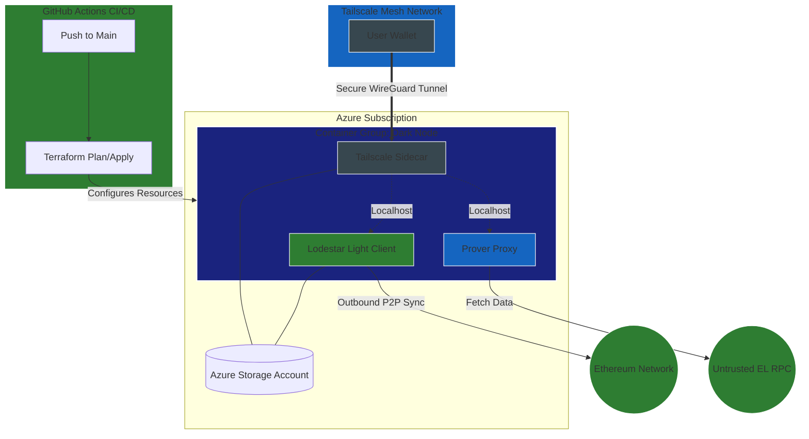
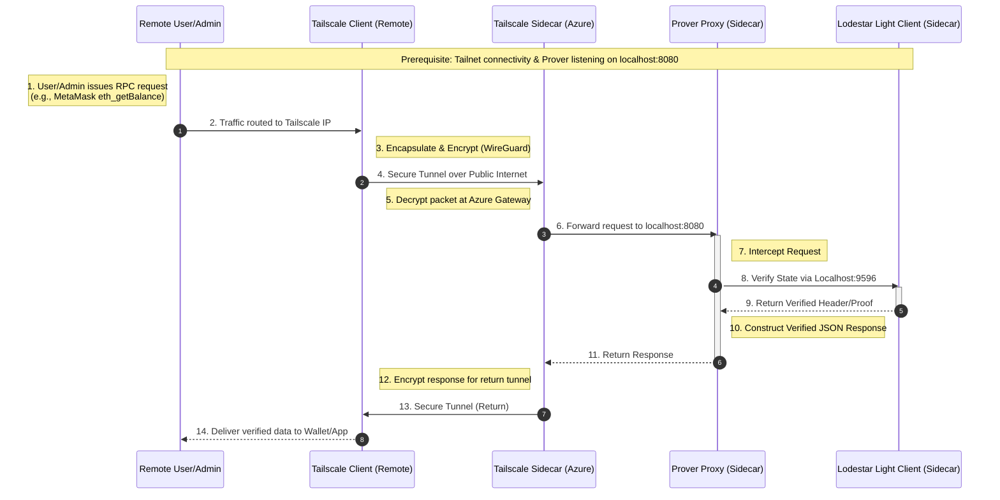
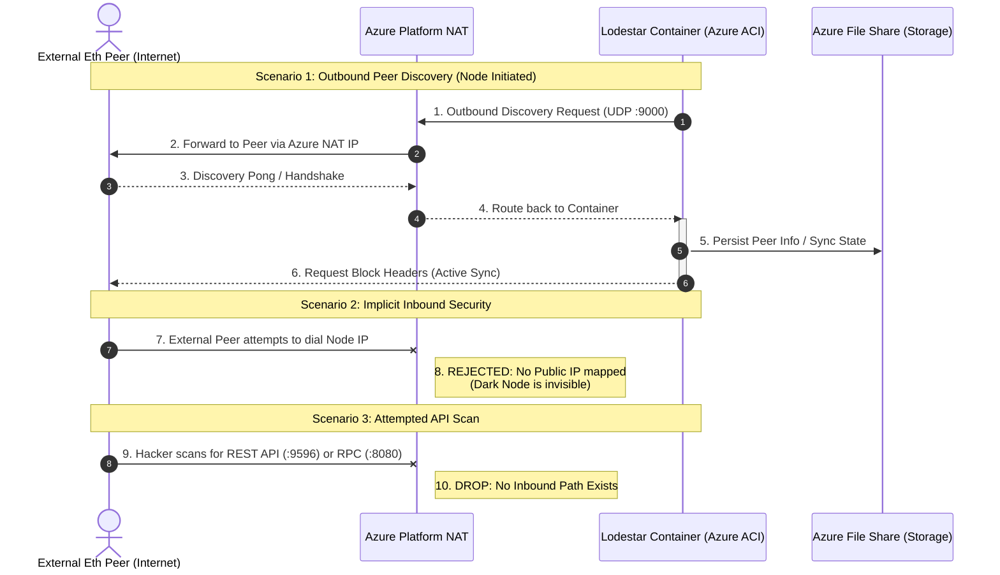

# Low level design

## Description of solution
This architecture implements a highly secure, cost-optimized Ethereum light node using a "Dark Node" pattern within Azure Container Instances (ACI). By eliminating the Virtual Network (VNet), Network Security Groups (NSG), and Public IP address, the solution reduces the cloud infrastructure footprint to its absolute minimum, significantly lowering monthly Azure costs and removing the public attack surface.

The solution is orchestrated as a single ACI Container Group containing three specialized containers:

Lodestar Light Client: The core consensus engine that performs outbound-only synchronization with the Ethereum P2P network. It maintains a trust-minimized view of the blockchain by syncing headers and verifying data availability.

Lodestar Prover Proxy: A specialized RPC bridge that listens on the container group’s internal loopback interface. It intercepts standard JSON-RPC requests from user wallets and cryptographically verifies the data.

Tailscale Sidecar: The sole entry point for management and interaction. It establishes an encrypted WireGuard tunnel to the user’s private mesh network (Tailnet). This allows the user to interact with the Prover Proxy via a private Tailscale IP or MagicDNS name, ensuring the node remains completely invisible to the public internet.

The entire stack is deployed as Infrastructure as Code (IaC) using Terraform, with state managed in a secure Azure Storage account. Persistence is handled via an Azure File Share mount, ensuring that both Ethereum chain segments and Tailscale identity state persist across container restarts. This design achieves the project's primary goal: a functional, verified Ethereum interface that is "dark" by default, secure by design, and optimized for a restricted budget.
## Low level diagram of solution




### Terraform Configuration (backend.tf)

```hcl
terraform {
  backend "azurerm" {
    resource_group_name  = "rg-lodestar-node"
    storage_account_name = "stethterraformstate"
    container_name       = "tfstate"
    key                  = "terraform.tfstate"
  }
}
```

### Terraform Configuration (main.tf)

This configuration uses a Multi-Container Group. Lodestar runs the node, and Tailscale provides the secure tunnel for a remote connection. Azure Files is utilized to persist the node state and Tailscale's identity.

```hcl
# main.tf (Finalized Ethereum Node Architecture)
variable "location" {
  default = "australiaeast"
}

variable "tailscale_key" {
  description = "Tailscale Auth Key"
  type        = string
  sensitive   = true
}

#variable "infura_url" {
#  description = "Execution Layer RPC URL (Infura/Alchemy)"
#  type        = string
#}

variable "log_analytics_workspace" {
  description = "Log analytics workspace for container logging"
  type = string
}

variable "checkpoint_root" {
  description = "Block root for recent sepolia checkpoint"
  type = string
}
  


data "azurerm_resource_group" "eth_node" {
  name = "rg-lodestar-node"
}

data "azurerm_log_analytics_workspace" "lodestar_logs" { 
  name = var.log_analytics_workspace
  resource_group_name = data.azurerm_resource_group.eth_node.name 
}


# ----------------------------------------------------------
# 1. Storage Configuration
# ----------------------------------------------------------
resource "azurerm_storage_account" "storage" {
  name                     = "stlodestardata499"
  resource_group_name      = data.azurerm_resource_group.eth_node.name
  location                 = data.azurerm_resource_group.eth_node.location
  account_tier             = "Standard"
  account_replication_type = "LRS"
}

# Separate share for Ethereum chain data
resource "azurerm_storage_share" "lodestar_share" {
  name                 = "lodestar-data"
  storage_account_name = azurerm_storage_account.storage.name
  quota                = 10
}

# Separate share for Tailscale state (identity/keys)
resource "azurerm_storage_share" "tailscale_share" {
  name                 = "tailscale-state"
  storage_account_name = azurerm_storage_account.storage.name
  quota                = 1
}

# ---------------------------------------------------------
# 2. Container Group (The Lodestar Light Node)
# ---------------------------------------------------------
resource "azurerm_container_group" "node_group" {
  name                = "lodestar-light-node"
  location            = data.azurerm_resource_group.eth_node.location
  resource_group_name = data.azurerm_resource_group.eth_node.name
  os_type             = "Linux"
  ip_address_type     = "None" # No Public IP
  restart_policy = "Always"
  diagnostics { 
    log_analytics { 
      workspace_id = data.azurerm_log_analytics_workspace.lodestar_logs.workspace_id 
      workspace_key = data.azurerm_log_analytics_workspace.lodestar_logs.primary_shared_key 
    } 
  }

  # --- Lodestar Light Client ---

  container {
    name   = "lodestar"
    image  = "chainsafe/lodestar:latest"
    cpu    = "1.0"
    memory = "2.0"
    
    ports {
      port     = 9596
      protocol = "TCP"
    }

    commands = [
      "/bin/sh", "-c",
      <<-EOT
        exec node /usr/app/packages/cli/bin/lodestar.js lightclient \
          --network sepolia \
          --beaconApiUrl https://lodestar-sepolia.chainsafe.io \
          --checkpointRoot ${var.checkpoint_root} \
          --dataDir /data \

          --logLevel verbose
      EOT
  ]
# Removed from commands above
#          --logFile /dev/stdout \
#        --logFileLevel verbose \
    
    volume {
      name                 = "lodestar-storage"
      mount_path           = "/data"
      share_name           = azurerm_storage_share.lodestar_share.name
      storage_account_name = azurerm_storage_account.storage.name
      storage_account_key  = azurerm_storage_account.storage.primary_access_key
    }
  }

# --- Lodestar Prover Execution Proxy ---
container {
  name   = "prover"
  image  = "chainsafe/lodestar:latest"
  cpu    = "0.5"
  memory = "1.0"

  ports {
    port     = 8080
    protocol = "TCP"
  }

  commands = [
    "/bin/sh", "-c",
    <<-EOT
      echo "Starting Lodestar Prover as a standalone proxy..." && \
      exec node /usr/app/packages/prover/bin/lodestar-prover.js proxy \
        --network sepolia \
        --executionRpcUrl https://lodestar-sepoliarpc.chainsafe.io \
        --beaconUrls https://lodestar-sepolia.chainsafe.io \
        --port 8080 \
        --logLevel verbose
    EOT
  ]
}


  container {
    name   = "tailscale"
    image  = "tailscale/tailscale:latest"
    cpu    = "0.5"
    memory = "0.5"

    environment_variables = {
      TS_AUTHKEY    = var.tailscale_key
      TS_STATE_DIR  = "/var/lib/tailscale"
      TS_USERSPACE  = "true" # Mandatory for ACI
      TS_EXTRA_ARGS = "--hostname=eth-light-node --accept-dns=false"
    }

    volume {
      name                 = "tailscale-state"
      mount_path           = "/var/lib/tailscale"
      share_name           = azurerm_storage_share.tailscale_share.name
      storage_account_name = azurerm_storage_account.storage.name
      storage_account_key  = azurerm_storage_account.storage.primary_access_key
    }
  }
}
```

### Terraform configuration (providers.tf)
```hcl
terraform {
  required_providers {
    azurerm = {
      source  = "hashicorp/azurerm"
      version = "~> 3.0"
    }
  }
}

provider "azurerm" {
  features {}
  skip_provider_registration = true
}
```

### Outputs.tf
```terraform
output "container_group_name" {
  description = "The name of the deployed container group."
  value       = azurerm_container_group.node_group.name
}

output "storage_account_name" {
  description = "The name of the storage account (useful for logs/portal access)."
  value       = azurerm_storage_account.storage.name
}

output "tailscale_hostname" {
  description = "The hostname to use in your wallet/browser once Tailscale is connected."
  value       = "eth-light-node"
}

output "rpc_connection_string" {
  description = "The internal RPC endpoint accessible via Tailscale."
  value       = "http://eth-light-node:8080"
}

output "how_to_verify" {
  description = "Command to run from your local machine to verify the node is alive."
  value       = "curl -X POST -H 'Content-Type: application/json' --data '{\"jsonrpc\":\"2.0\",\"method\":\"eth_blockNumber\",\"params\":[],\"id\":1}' http://eth-light-node:8080"
}
```

### GitHub Actions Workflow (terraform-test.yml)
To automate the deployment of the solution, Azure credentials and Tailscale key are stored in GitHub Secrets.

Azure Service Principal: Created using az ad sp create-for-rbac and save the JSON as AZURE_CREDENTIALS.

Tailscale Key: Created with an Auth Key (reusable recommended) in the Tailscale dashboard and saved as TAILSCALE_KEY.

```yaml
name: 'Terraform Test Deployment'

on:
  push:
    branches: [ "main" ]

permissions:
  contents: read

jobs:
  terraform:
    runs-on: ubuntu-latest
    env:
      ARM_CLIENT_ID: ${{ secrets.AZURE_CLIENT_ID}}
      ARM_CLIENT_SECRET: ${{ secrets.AZURE_CLIENT_SECRET }}
      ARM_SUBSCRIPTION_ID: ${{ secrets.AZURE_SUBSCRIPTION_ID }}
      ARM_TENANT_ID: ${{ secrets.AZURE_TENANT_ID }}
      TF_VAR_tailscale_key: ${{ secrets.TAILSCALE_KEY }}
 ##   TF_VAR_infura_url: ${{ secrets.INFURA_URL }}
      TF_VAR_log_analytics_workspace: ${{secrets.LOG_ANALYTICS_WORKSPACE}}
      TF_VAR_checkpoint_root: "0x94f1c2b606d57b522baab0d0a617f3bfb23ae4873c5eb91dc6c9c1476e9ce96a"

    steps:
    - name: Checkout Code
      uses: actions/checkout@v4

    - name: Setup Terraform
      uses: hashicorp/setup-terraform@v3

    - name: Terraform Init
      run: terraform init
      working-directory: ./terraform-test

#    - name: Terraform Plan
#      run: terraform plan
#      working-directory: ./terraform-test

#    - name: Terraform Apply
#      run: terraform apply -auto-approve
#      working-directory: ./terraform-test

      # Add the Destroy step
    - name: Terraform Destroy
      run: terraform destroy -auto-approve
      working-directory: ./terraform-test
```

### GitHub Repository Structure


```Plaintext
.
├── .github/workflows/terraform-test.yml  # GitHub Actions CI/CD
├── main.tf                       # Terraform: ACI, Storage, and Logic
├── backend.tf                    # Backend configuration
├── outputs.tf                    #
└── providers.tf                  # Azure provider config

```

## Sequence diagrams for protocol interactions

### Sequence diagram for remote admin



### Sequence diagram for internet to Lodestar Client.


## Detailed breakdown of costs
## Detailed description of security risks and mitigations

### Security Risk Assessment

The exposure is divided into these vectors:

* **The Trusted Proxy (Internal Loopback):** If the Lodestar prover process is compromised, it could return fraudulent transaction data.
* **The Supply Chain (Container Group):** With three containers (`lodestar`, `prover`, `tailscale`) sharing a single network namespace and disk mount, a vulnerability in any one image can compromise the entire group.
* **Outbound Data Leakage:** The Azure Instance's existence and metadata is leaked to the global Ethereum DHT via peer connections.

---

### Potential Attack Scenarios

#### A. Eclipse Attacks (Outbound)
Even without a public IP, the node must "reach out" to find peers. An attacker who controls a large number of nodes could still attempt to "eclipse" the light client if it happens to connect exclusively to their malicious nodes. Without a public ENR for others to find you, you rely entirely on your node's ability to pick "honest" peers from the bootstrap list.

#### B. Sidecar Escape
Since all three containers share the same **localhost** and **File Share**, they are in the same trust zone. If the Prover Proxy (which talks to an untrusted external Execution RPC like Infura) is exploited, an attacker could pivot to the Tailscale container to access the private mesh network or manipulate the Lodestar client's state.

#### C. Credential/Identity Cloning
If the Azure Storage Account keys are leaked, an attacker can download the `tailscale-state` from the file share. They could then impersonate the node on your private Tailnet, potentially intercepting your wallet's transactions or gaining access to other devices in your mesh.

---

### Risk Mitigation Strategy

The following steps can be taken to further enhance the security of this solution. For the purposes of this proof of concept these steps are recommendations only.

#### 1. Infrastructure & Storage Hardening
* **Storage Firewalls:** Configure the Storage Account to **"Enabled from selected virtual networks and IP addresses."** Since we are not using a VNet, restrict access to the specific Azure Service Principal or use **Private Endpoints** if budget allows later.
* **Secure the Terraform state backend:** To connect to an Azure file share, container instances must use CIFS authentication this explicitly requires the use of the storage account name and master storage key as the password. These appear as PLAINTEXT within the terraform state file. It is vital to secure the storage account containing the terraform state. 
* **Disk Isolation:** If possible, use separate sub-folders or separate File Shares for Lodestar data and Tailscale state to prevent a compromised container from accessing all persistent data.

### 2. Network & Proxy Security
* **Localhost Binding:** Explicitly bind the Lodestar REST API (`--rest.address 127.0.0.1`) and the Prover Proxy to loopback. This ensures that even if an Azure networking error occurred, these ports are never reachable outside the container group.
* **Tailscale ACLs (Identity-Based):** In the Tailscale console, use **Tags** (e.g., `tag:eth-node`). Set an ACL rule that allows `YOUR_USER` to access `tag:eth-node` on **Port 8080 only**. The node should have no permission to initiate traffic to any other device on your Tailnet.
* **Prover Verification:** Always verify the `infura_url` (Execution Layer) is using **HTTPS** to prevent MITM attacks on the data the Prover is trying to verify.
* **MagicDNS:** If Tailscale MagicDNS is enabled, you can use `http://eth-light-node:8080` in MetaMask instead of the 100.x.y.z IP, which is much easier to manage.


### 3. Supply Chain & Lifecycle
* **Image Pinning (SHA256):** Do not use `:latest`. Pin `chainsafe/lodestar` and `tailscale/tailscale` to specific digest hashes. This ensures that a compromise of the Docker Hub repository does not automatically infect your node.
* **OIDC Authentication:** Transition GitHub Actions to use **Workload Identity Federation (OIDC)**. This removes the need to store long-lived `AZURE_CLIENT_SECRET` in GitHub, using short-lived tokens for each deployment instead. There is a youtube video on how to do this: https://www.youtube.com/watch?v=10ljwwJ3V30  
* **Resource Balancing:** Allocate at least **2.5 GB RAM** to the container group. Running three processes (Lodestar, Prover, and Tailscale) creates higher memory pressure; a node that crashes frequently is more vulnerable to state corruption during resync.


## Detailed implementation steps

The following steps detail how to implement the basic solution architecture. 

---

## Detailed Implementation Steps 

### Phase 1: Bootstrapping & Identity
Build the Terraform management plane.

#### Step 0 Open an Azure cloud shell
Log into the azure portal
Click on the >_ icon in the portal
Choose Bash (not powershell)

#### Step 1.0: Create the Target Resource Group
Commands:

RG_NAME="rg-lodestar-node"
LOCATION="australiaeast" 
az group create --name $RG_NAME --location $LOCATION


#### Step 1.1: Azure Service Principal (SPN) Creation
```bash
az ad sp create-for-rbac --name "github-eth-node-sp" --role contributor \
  --scopes /subscriptions/{subscription-id}/resourceGroups/rg-lodestar-node \
  --json-auth
```

#### Step 1.2: Terraform Backend Setup
* **Action:** Create the Storage Account for state management.
```bash
STORAGE_NAME="stethterraformstate"
az storage account create --name $STORAGE_NAME --resource-group rg-lodestar-node --location eastus --sku Standard_LRS
az storage container create --name tfstate --account-name $STORAGE_NAME
echo "Store this in GitHub Secrets as TF_STATE_STORAGE_ACCOUNT: $STORAGE_NAME"
```


### Phase 2: Repository & Secret Management

#### Step 2.1: Secure Tailscale & Infura Secrets
1. **Tailscale:** Generate an **Auth Key** in the Tailscale Admin Console. 
   - **Settings:** Reusable = Yes, Ephemeral = Yes, Pre-authorized = Yes.
   - **Action:** Save to GitHub Secrets as `TAILSCALE_KEY`.

#### Step 2.2: GitHub Secrets Injection
* **Action:** Populate GitHub Secrets with:
    * `AZURE_CLIENT_ID`, `AZURE_CLIENT_SECRET`, `AZURE_TENANT_ID`, `AZURE_SUBSCRIPTION_ID`
    * `TAILSCALE_KEY`

---

### Phase 3: Infrastructure Deployment

#### Step 3.1: Terraform Apply
* **Action:** Trigger GitHub Actions to deploy the `main.tf` with `ip_address_type = "None"`.
* **Verification:** Navigate to the Azure Portal > Container Groups.
    * **Confirm:** The group exists.
    * **Confirm:** There is **no Public IP address** assigned to the instance.

---

### Phase 4: Container Orchestration & Networking

#### Step 4.1: Sidecar Initialization (Tailscale)
* **Action:** Monitor the Tailscale Admin Console.
* **Verification:** A new machine named `eth-light-node` should appear. Note its **Tailscale IP** (100.x.y.z).

#### Step 4.2: Lodestar & Prover Startup
* **Action:** Stream the logs for the three containers:
    ```bash
    # Check Light Client Sync
    az container logs -g rg-lodestar-node -n lodestar-dark-node --container-name lodestar
    # Check Prover Proxy Connectivity
    az container logs -g rg-lodestar-node -n lodestar-dark-node --container-name prover
    ```
* **Verification:** * `lodestar`: Look for `Updated state.finalizedHeader`.
    * `prover`: Look for `Proof provider ready`.

---

### Phase 5: Final Validation & Connectivity

#### Step 5.1: The "Verified RPC" Test
We verify that MetaMask/Rabby can talk to the **Prover**, which in turn talks to **Lodestar**.
* **Action:** From a local laptop (with Tailscale active), run:
    ```bash
    curl -X POST -H "Content-Type: application/json" \
      --data '{"jsonrpc":"2.0","method":"eth_blockNumber","params":[],"id":1}' \
      http://eth-light-node:8080
    ```
* **Verification:** You should receive a hex block number.  EXAMPLE OUTPUT : {"jsonrpc":"2.0","id":1,"result":"0xa63cef"}

---
