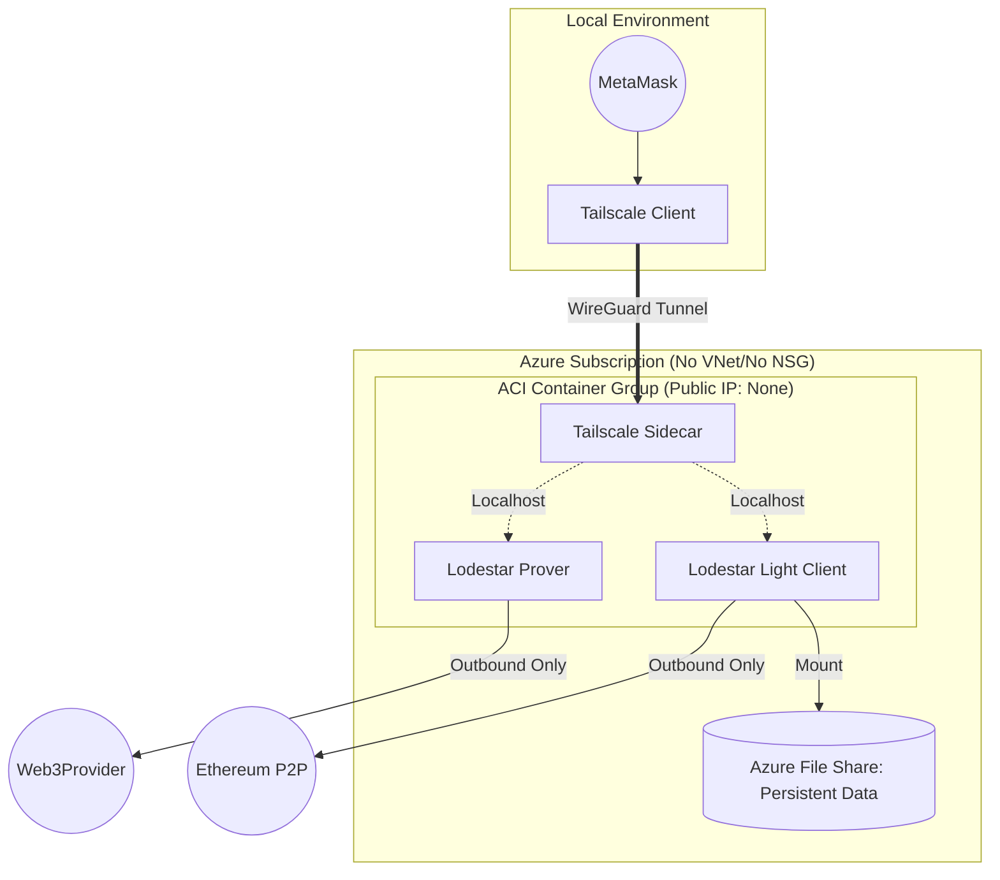

# 🚀 Cost-Optimized Ethereum Node on Azure

Managed node providers (Infura, Alchemy, QuickNode) are excellent but expensive at scale. This project provides a **production-ready framework** to host your own Ethereum Light Nodes on Azure for a fraction of the cost.

### 💰 Estimated Monthly Infrastructure Costs (Azure 2026)

This project leverages **Azure Container Instances (ACI)** to provide a serverless, "pay-as-you-go" infrastructure. By avoiding dedicated VMs and using **Tailscale** for private networking, we eliminate the need for expensive Load Balancers and Public IPs.

| Resource Component        | Minimum (Low Traffic) | Monthly Cost | Recommended (Production) | Monthly Cost |
| :------------------------ | :-------------------- | :----------- | :----------------------- | :----------- |
| **Compute (vCPU)**        | 0.85 vCPU Total       | ~$30.15      | 1.75 vCPU Total          | ~$62.10      |
| **Memory (RAM)**          | 1.6 GiB Total         | ~$6.30       | 3.5 GiB Total            | ~$13.80      |
| **Storage (Azure Files)** | 32 GB Standard Hot    | ~$5          | 32 GB Standard Hot       | ~$5          |
| **Networking**            | Private VNet + Tailscale | $0.00     | Private VNet + Tailscale | $0.00        |
| **Estimated Total**       | **Daily: ~$1.25**     | **$37.45**   | **Daily: ~$2.60**        | **$77.90**   |

### 💡 Why This Architecture?
* **Zero Idle Waste:** ACI bills per-second of usage. If you stop the containers, you stop the billing.
* **No "Cloud Tax":** Bypassing Public IPs and Load Balancers saves ~$25-$40/month in standard Azure networking fees.
* **Lodestar Optimized:** Uses the TypeScript-based Lodestar client, specifically tuned for low-memory environments like containers.
* **Privacy First:** Traffic remains within your private Tailscale network, invisible to the public internet and protected from ISP/Cloud provider snooping.

## 🌟 Business Value & Key Features
*   **Cost Reduction:** Leverage Azure container instances and Light Node sync modes to cut costs by 60-80%.
*   **Infrastructure as Code (IaC):** 100% automated deployment via Terraform—no manual configuration errors.
*   **Full Data Sovereignty:** Own your RPC endpoints. No rate limits, no third-party tracking.
*   **Enterprise-Ready:** Built-in support for Azure Key Vault (Security) and Resource Groups (Organization).

## 🛠 Tech Stack
*   **Cloud:** Microsoft Azure
*   **Provisioning:** Terraform
*   **Blockchain:** Ethereum Mainnet / Sepolia
*   **Connectivity:** Tailscale

---

## 🚀 Deployment in 3 Steps
1. **Clone & Initialize:** `git clone ... && terraform init`
2. **Configure:** Update TF_VARIABLEs with your Azure Subscription ID.
3. **Deploy:** `terraform apply`

---

## 💼 Need a Custom Solution? 
I specialize in helping Enterprises scale their infrastructure while minimizing cloud spend. 
[**Hire me on Upwork for your Web3 DevOps needs**]

## Further documentation

### [1) Project plan](ProjectPlan.md)
### [2) Requirements Analysis](RequirementsAnalysis.md)
### [3) High level design](HighLevelDesign.md)
### [4) Low level design](LowLevelDesign.md)
### [5) Implementation](AsBuilt.md)
### [6) Project de-brief ]()

