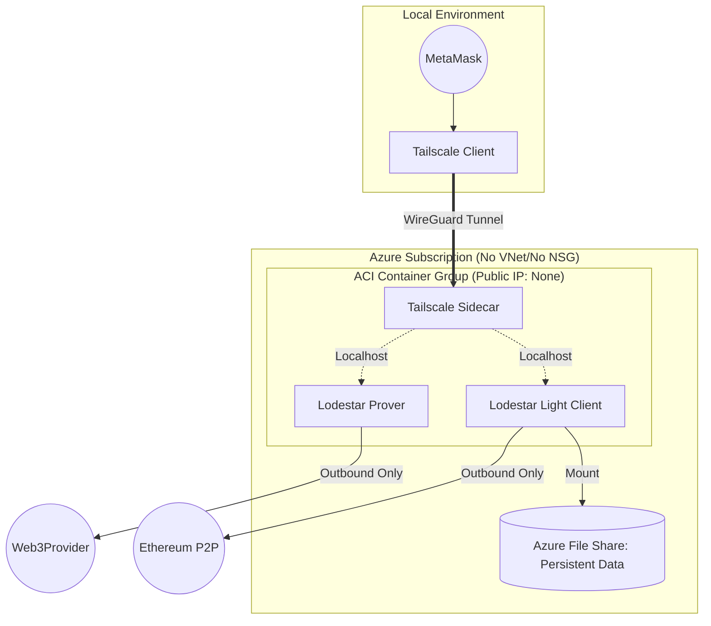

# 🚀 Cost-Optimized Ethereum Node on Azure

This project provides a **production-ready framework** to host your own Ethereum Light Nodes on Azure enabling direct blockchain interactions for a fraction of the cost of a full node without relying on a managed node provider such as Infura or Alchemy.

### 💰 Estimated Infrastructure Costs (Azure 2026)

This project leverages **Azure Container Instances (ACI)** to provide a simplified, serverless, "pay-as-you-go" infrastructure. By avoiding dedicated VMs and using Tailscale for private networking, we eliminate the need for expensive Load Balancers and Public IPs and complex networking and security configuration. **The costs shown below are for 100% utilization.** The light node containerised Azure resources can be deployed when neeeded using the latest checkpoint block route to avoid startup overheads for CPU and data transfer. Stop the container group to stop billing.

| Resource Component        | Minimum (Low Traffic) | Maximum Monthly Cost | Recommended (Production) | Maximum Monthly Cost |
| :------------------------ | :-------------------- | :----------- | :----------------------- | :------------------- |
| **Compute (vCPU)**        | 1 vCPU Total          | ~$30         | 1.75 vCPU Total          | ~$58         |
| **Memory (RAM)**          | 1.5 GiB Total         | ~$6          | 3.5 GiB Total            | ~$11         |
| **Storage (Azure Files)** | 32 GB Standard Hot    | ~$5          | 32 GB Standard Hot       | ~$5          |
| **Networking**            | Tailscale             | $0.00        | Tailscale | $0.00        |
| **Estimated Total** (USD) | **Max Daily: ~$1.20** | **Max Monthly ~$41**      | **Max Daily: ~$2.60**        | **Max Monthly ~$74**      |

### 💡 Why This Architecture?
* **Zero Idle Waste:** ACI bills per-second of usage. If you stop the containers, you stop the billing.
* **No "Cloud Tax":** Bypassing Public IPs and Load Balancers saves ~$25-$40/month in standard Azure networking fees.
* **Lodestar Optimized:** Uses the TypeScript-based Lodestar client, specifically tuned for low-memory environments like containers.
* **Privacy First:** Wallet based transactions and admin traffic remain within your private Tailscale network, invisible to the public internet.

## :warning: Pre-requisites
*  **GitHub account**
*  **Azure subscription**
*  **Tailscale account**

## 🌟 Business Value & Key Features
*   **Cost Reduction:** Leverage Azure container instances and Light Node sync modes to cut costs.
*   **Infrastructure as Code (IaC):** 100% automated deployment via Terraform—no manual configuration errors.
*   **Full Data Sovereignty:** Own your RPC endpoints. No rate limits, no third-party tracking.
*   **Scaleable:** Scale out by adding more instances or scale up by re-sizing the containers

## 🛠 Tech Stack
*   **Cloud:** Microsoft Azure
*   **Provisioning:** GitHub actions using Azure based Terraform state file
*   **Blockchain:** Ethereum Mainnet / Sepolia
*   **Connectivity:** Tailscale

---

## 🚀 Deployment in 4 stages: (See )
1. **Bootstrap:** Azure infrastructure and Service Principal
2. **Configure GitHub secrets:** Add github secrets for your environment.
3. **Deploy:** `terraform apply` via GitHub actions
4. **Verify** Check log files, container logs, and test RPC for wallet connectivity.

---

## Further documentation

### [1) Project plan](ProjectPlan.md)
### [2) Requirements Analysis](RequirementsAnalysis.md)
### [3) High level design](HighLevelDesign.md)
### [4) Low level design](LowLevelDesign.md)
### [5) Implementation](AsBuilt.md)
### [6) Project de-brief ]()

